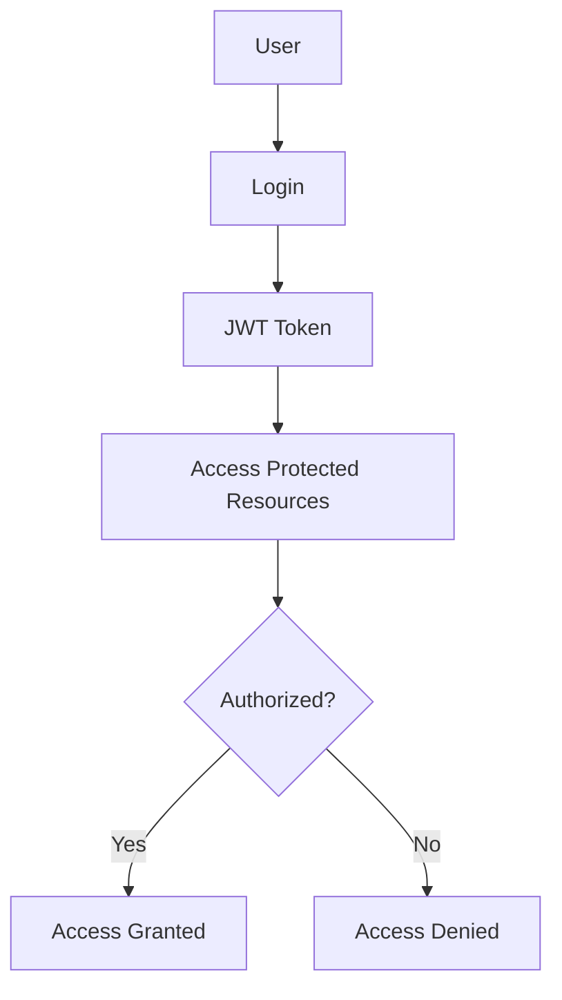

# SalsetDatees API

A comprehensive modern backend API built with NestJS, featuring robust authentication, authorization, file management, and more.

## Table of Contents

- [SalsetDatees API](#salsetdatees-api)
  - [Table of Contents](#table-of-contents)
  - [Introduction](#introduction)
  - [Architecture](#architecture)
  - [Getting Started](#getting-started)
    - [Prerequisites](#prerequisites)
    - [Installation](#installation)
  - [Module Documentation](#module-documentation)
  - [Authentication and Authorization](#authentication-and-authorization)
  - [API Response Format](#api-response-format)
  - [Error Handling](#error-handling)
  - [Development Guidelines](#development-guidelines)

## Introduction

This project is a modern, feature-rich REST API built with NestJS, TypeORM, and PostgreSQL. It provides a solid foundation for building secure, scalable applications with features like:

- JWT-based authentication with refresh tokens
- Role-based access control using CASL
- Comprehensive file management with MinIO
- Standardized API responses and error handling
- Modular architecture for maintainability

## Architecture

The application follows a modular architecture with clearly separated concerns:

```
src/
├── auth/           # Authentication module
├── users/          # User management
├── article/        # Article management
├── role/           # Role definitions
├── permissions/    # Permission definitions
├── casl/           # CASL ability definitions
├── minio-files/    # File management
├── common/         # Shared utilities
└── config/         # Configuration
```

Each module is self-contained with its own controllers, services, DTOs, and entities.

## Getting Started

### Prerequisites

- Node.js (>= 14.x)
- PostgreSQL
- Redis
- MinIO server

### Installation

1. Clone the repository
2. Install dependencies: `npm install`
3. Configure environment variables (see `.env.example`)
4. Run migrations: `npm run migration:run`
5. Start the server: `npm run start:dev`

## Module Documentation

Detailed documentation for each module:

- [Authentication Module](./docs/AUTH.md) - Authentication flow, JWT tokens, and login/logout
- [Users Module](./docs/USERS.md) - User management and operations
- [File System Module](./docs/FILES.md) - MinIO integration and file operations
- [CASL Authorization](./docs/CASL.md) - Role-based access control implementation
- [Response Format](./docs/RESPONSE.md) - Standardized response format and interceptors
- [Error Handling](./docs/ERRORS.md) - Error handling strategies and custom exceptions

## Authentication and Authorization

The application uses JWT-based authentication with refresh tokens stored in Redis. Authorization is handled via CASL, providing fine-grained access control based on user roles and permissions.



See the [Authentication Module](./docs/AUTH.md) and [CASL Authorization](./docs/CASL.md) docs for details.

## API Response Format

All API responses follow a standardized format:

```json
{
  "success": true,
  "statusCode": 200,
  "message": ["Operation completed successfully"],
  "data": {
    // Response data here
  }
}
```

Error responses include validation errors and detailed messages:

```json
{
  "success": false,
  "statusCode": 400,
  "message": ["Please enter valid data"],
  "validationErrors": {
    "email": ["must be a valid email"],
    "password": ["must be at least 8 characters"]
  }
}
```

See [Response Format](./docs/RESPONSE.md) for more details.

## Error Handling

The application uses custom exception filters and validators to provide consistent error handling across all endpoints. See [Error Handling](./docs/ERRORS.md) for details.

## Development Guidelines

- All new features should include unit tests
- Follow the existing pattern for controllers, services, and DTOs
- Use the ResponseInterceptor for all responses
- Validate all input with class-validator
- Document all new endpoints with Swagger annotations
- Add appropriate CASL policies for new resources

For more detailed guidance, refer to the specific module documentation linked above.
