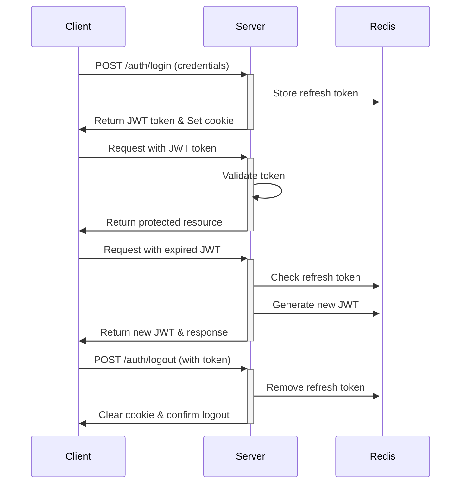

# Authentication Module

The authentication module provides a complete JWT-based authentication system with refresh tokens stored in Redis.

## Table of Contents

- [Authentication Module](#authentication-module)
  - [Table of Contents](#table-of-contents)
  - [Overview](#overview)
  - [Authentication Flow](#authentication-flow)
  - [API Endpoints](#api-endpoints)
    - [Login](#login)
    - [Register](#register)
    - [Logout](#logout)
  - [JWT Token Structure](#jwt-token-structure)
    - [Access Token Payload](#access-token-payload)
  - [Refresh Token Mechanism](#refresh-token-mechanism)
  - [Security Considerations](#security-considerations)
  - [Integration Guide](#integration-guide)
    - [Frontend Integration](#frontend-integration)
    - [Securing API Endpoints](#securing-api-endpoints)
    - [Accessing User Data](#accessing-user-data)

## Overview

The authentication system uses:

- JWT tokens for access control
- Redis for storing refresh tokens
- Passport.js for authentication strategies
- HTTP-only cookies for secure token storage

## Authentication Flow



## API Endpoints

### Login

```
POST /api/auth/login
```

**Request Body:**

```json
{
  "email": "user@example.com",
  "password": "securepassword"
}
```

**Response:**

```json
{
  "success": true,
  "statusCode": 200,
  "message": ["User login has been successfully"],
  "data": {
    "access_token": "eyJhbGciOiJIUzI1NiIsInR5cCI6IkpXVCJ9...",
    "cookie_expires_in": 18000
  }
}
```

The server also sets an HTTP-only cookie named `access_token` with the JWT.

### Register

```
POST /api/auth/register
```

**Request Body:**

```json
{
  "email": "newuser@example.com",
  "password": "securepassword",
  "firstName": "First",
  "lastName": "Last"
}
```

**Response:**

```json
{
  "success": true,
  "statusCode": 201,
  "message": ["User registered successfully"],
  "data": {
    "id": "uuid-here",
    "email": "newuser@example.com",
    "firstName": "First",
    "lastName": "Last",
    "createdAt": "2023-01-01T00:00:00.000Z",
    "updatedAt": "2023-01-01T00:00:00.000Z"
  }
}
```

### Logout

```
POST /api/auth/logout
```

**Request:**
The JWT token is extracted from the cookie or Authorization header.

**Response:**

```json
{
  "success": true,
  "statusCode": 200,
  "message": ["Logout successful"]
}
```

The server also clears the `access_token` cookie.

## JWT Token Structure

### Access Token Payload

```typescript
{
  "user_id": "uuid-of-user",
  "refresh_token_id": "uuid-of-refresh-token",
  "iat": 1618939806, // Issued at
  "exp": 1618943406  // Expiration
}
```

## Refresh Token Mechanism

Refresh tokens are stored in Redis with this structure:

```typescript
{
  "id": "uuid-of-token",
  "userId": "uuid-of-user",
  "user": {
    // User data including roles
  },
  "createdAt": "2023-01-01T00:00:00.000Z",
  "expiresAt": "2023-01-02T00:00:00.000Z"
}
```

When an access token expires:

1. The system extracts the refresh token ID from the expired JWT
2. Checks Redis for a valid refresh token with that ID
3. If found and not expired, issues a new JWT
4. Sets the new JWT as a cookie

This happens automatically via the `JwtAuthGuard` and doesn't require client-side action.

## Security Considerations

- JWT tokens are short-lived (typically 15 minutes)
- Refresh tokens have a longer lifespan (typically 5 days)
- All tokens are invalidated on password change
- Tokens are stored as HTTP-only cookies to prevent XSS attacks
- Multiple refresh tokens are allowed per user for multiple devices

## Integration Guide

### Frontend Integration

1. Make a POST request to `/api/auth/login` with credentials
2. The JWT will be automatically stored as a cookie
3. For subsequent requests, the cookie will be sent automatically
4. No additional configuration is needed for token renewal

### Securing API Endpoints

Use the `JwtAuthGuard` to protect your controllers or routes:

```typescript
@Controller('example')
@UseGuards(JwtAuthGuard)
export class ExampleController {
  // Protected routes
}
```

Or for specific endpoints:

```typescript
@Get('protected')
@UseGuards(JwtAuthGuard)
getProtectedData() {
  // Protected route
}
```

### Accessing User Data

The authenticated user is available in the request object:

```typescript
@Get('profile')
@UseGuards(JwtAuthGuard)
getProfile(@Request() req) {
  return req.user; // Contains the authenticated user data
}
```

For more complex authorization, see the [CASL Authorization](./CASL.md) documentation.
