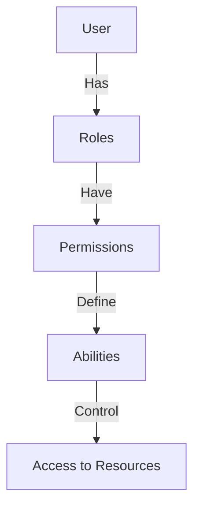
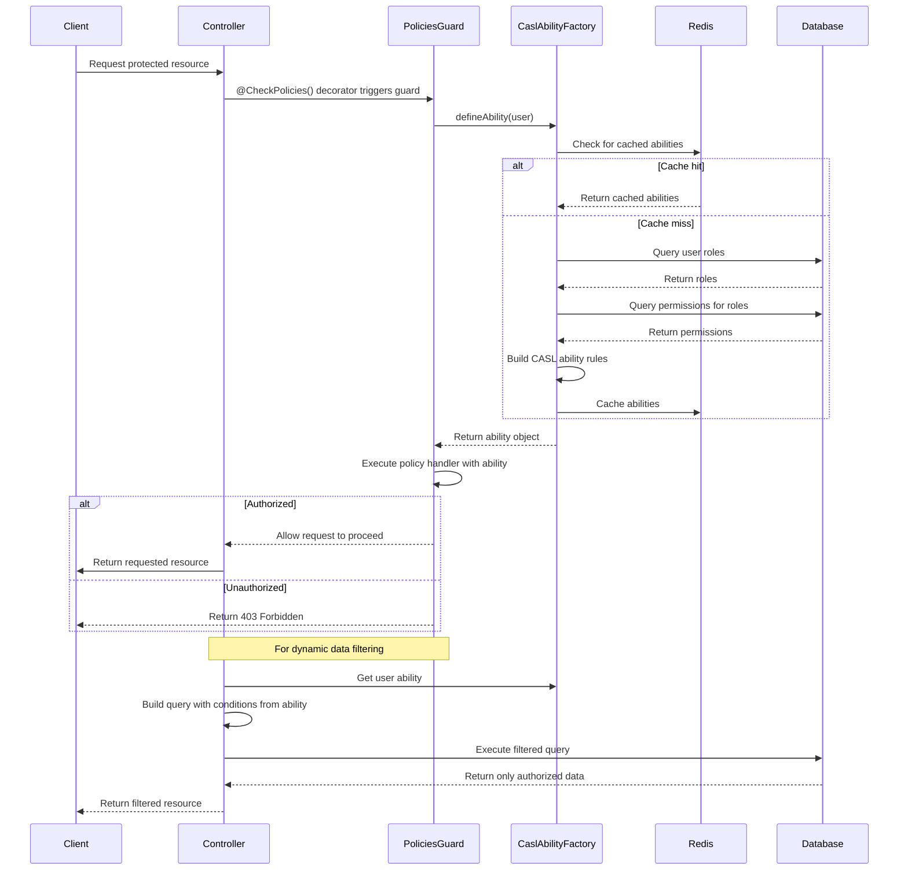
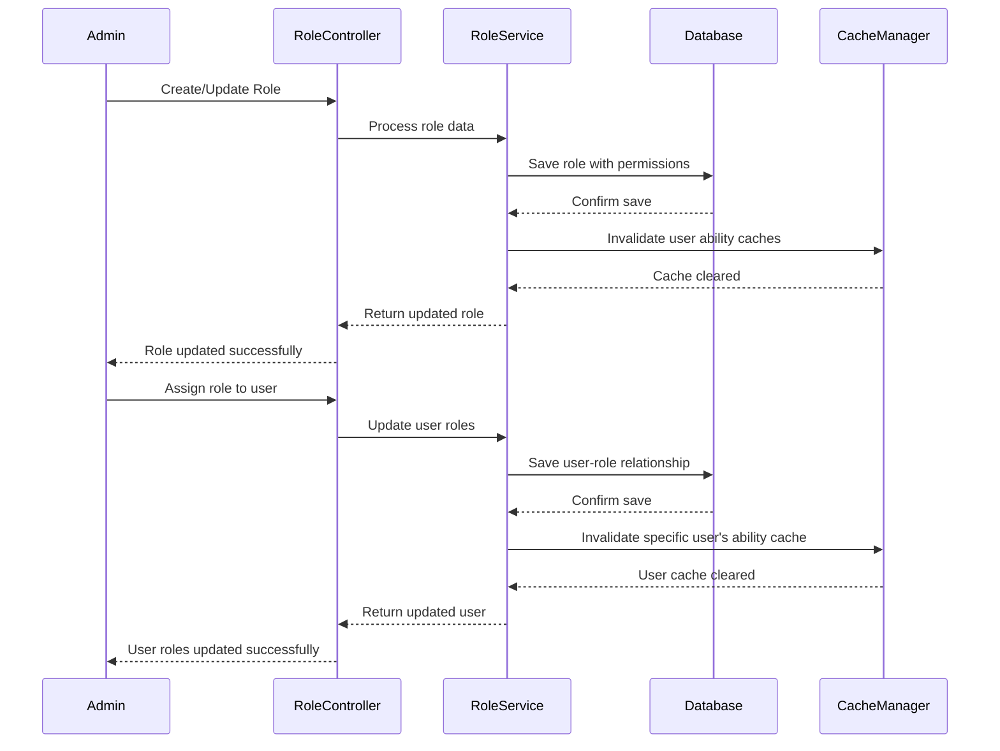
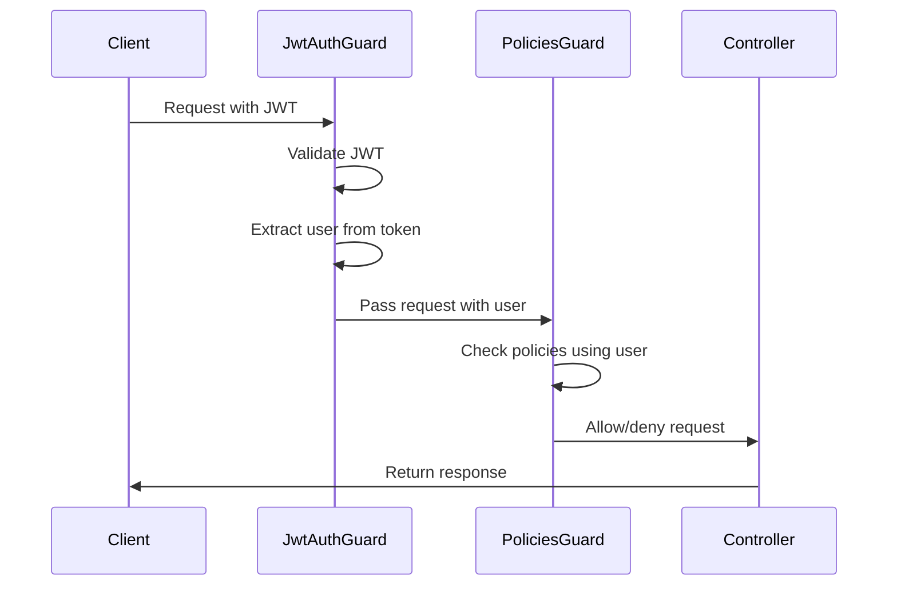

# CASL Authorization

The CASL module provides a robust, attribute-based access control system that integrates with NestJS controllers and services.

## Table of Contents

- [CASL Authorization](#casl-authorization)
  - [Table of Contents](#table-of-contents)
  - [Overview](#overview)
  - [Module Structure](#module-structure)
  - [Authorization Flow](#authorization-flow)
  - [Key Concepts](#key-concepts)
  - [Available Actions](#available-actions)
  - [Defining Permissions](#defining-permissions)
  - [Usage in Controllers](#usage-in-controllers)
  - [Dynamic Query Building](#dynamic-query-building)
  - [Checking Abilities](#checking-abilities)
  - [Role Management](#role-management)
  - [Permission Caching](#permission-caching)
  - [Best Practices](#best-practices)
  - [Integration with JWT Authentication](#integration-with-jwt-authentication)

## Overview

The authorization system uses CASL to define abilities based on roles and permissions. It integrates with PostgreSQL for storage and Redis for caching.



## Module Structure

The CASL module follows the standard NestJS module structure and is organized as follows:

```
src/
└── modules/
    └── casl/
        ├── abilities/                # Core ability definitions
        │   └── casl-ability.factory.ts
        ├── decorators/              # Custom decorators
        │   ├── check-policies.decorator.ts
        │   └── policies-key.decorator.ts
        ├── dto/                     # Data Transfer Objects
        │   ├── permission.dto.ts
        │   └── role-permission.dto.ts
        ├── entities/                # Database entities
        │   ├── permission.entity.ts
        │   └── role.entity.ts
        ├── guards/                  # Authorization guards
        │   └── policies.guard.ts
        ├── interfaces/              # Type definitions
        │   ├── policy-handler.interface.ts
        │   └── casl-permission.interface.ts
        ├── services/                # Business logic
        │   ├── permission.service.ts
        │   └── role.service.ts
        ├── utils/                   # Helper functions
        │   └── query-builder.utils.ts
        └── casl.module.ts           # Module definition
```

## Authorization Flow



## Key Concepts

- **Subjects**: Entities that can be acted upon (User, Article, Role, Permission, etc.)
- **Actions**: Operations that can be performed (create, read, update, delete, etc.)
- **Permissions**: Define what actions can be performed on which subjects
- **Roles**: Collections of permissions assigned to users
- **Abilities**: Determined by a user's roles and their associated permissions
- **Policies**: Functions that check if a user can perform an action on a resource
- **Conditions**: Dynamic rules that filter resources based on user context

## Available Actions

The system defines these core actions:

| Action              | Description                            |
| ------------------- | -------------------------------------- |
| `super-modify`      | Full system access                     |
| `manage`            | Full access to a specific resource     |
| `create`            | Create new instances of a resource     |
| `read`              | View or list resources                 |
| `update`            | Modify existing resources              |
| `delete`            | Remove resources                       |
| `update-user-roles` | Special permission for assigning roles |

## Defining Permissions

Permissions are created through the API and stored in the database. Each permission defines:

- **Action**: What can be done (from the actions list above)
- **Subject**: What it can be done to (e.g., 'User', 'Article')
- **Fields** (optional): Specific fields that can be acted upon
- **Conditions** (optional): Additional checks (e.g., only own articles)
- **Inverted** (boolean): Whether this is an allow or deny rule

Example permission configuration:

```json
{
  "action": "read",
  "subject": "Article",
  "fields": ["title", "content", "createdAt"],
  "conditions": { "authorId": "${user.id}" },
  "inverted": false
}
```

This permission allows a user to read only their own articles, and only the specified fields.

The permission entity structure:

```typescript
@Entity('permissions')
export class Permission {
  @PrimaryGeneratedColumn()
  id: number;

  @Column()
  action: string;

  @Column()
  subject: string;

  @Column({ type: 'jsonb', nullable: true })
  fields: string[];

  @Column({ type: 'jsonb', nullable: true })
  conditions: Record<string, any>;

  @Column({ default: false })
  inverted: boolean;

  @ManyToMany(() => Role, (role) => role.permissions)
  roles: Role[];
}
```

## Usage in Controllers

Protect entire controllers or specific endpoints using the `@CheckPolicies()` decorator:

```typescript
@articleControllerDecorators()
export class ArticleController {
  constructor(private readonly articlesService: ArticleService) {}

  @articleCreateEndpointDecorators()
  create(@Body() createArticleDto: CreateArticleDto, @Request() req) {
    return this.articlesService.create(createArticleDto, req.user.id);
  }
}
```

Where the decorator is defined as:

```typescript
export function articleCreateEndpointDecorators() {
  return applyDecorators(
    Post(),
    ApiOperation({ summary: 'Create a new article' }),
    ApiResponse({
      status: 201,
      description: 'The article as been successfully created.',
      type: ResponseArticleDto,
    }),
    ApiBody({ type: CreateArticleDto }),
    CheckPolicies(
      (ability: AppAbility) =>
        ability.can('create', 'Article') ||
        ability.can('super-modify', 'Article'),
    ),
  );
}
```

The `CheckPolicies` decorator works with the `PoliciesGuard`:

```typescript
@Injectable()
export class PoliciesGuard implements CanActivate {
  constructor(
    private reflector: Reflector,
    private caslAbilityFactory: CaslAbilityFactory,
  ) {}

  async canActivate(context: ExecutionContext): Promise<boolean> {
    const policyHandlers = this.reflector.get<PolicyHandler[]>(
      CHECK_POLICIES_KEY,
      context.getHandler(),
    ) || [];

    if (policyHandlers.length === 0) {
      return true; // No policies to check
    }

    const { user } = context.switchToHttp().getRequest();
    if (!user) {
      return false; // No user, no access
    }

    const ability = await this.caslAbilityFactory.defineAbility(user);

    return policyHandlers.every((handler) =>
      this.execPolicyHandler(handler, ability),
    );
  }

  private execPolicyHandler(handler: PolicyHandler, ability: AppAbility) {
    if (typeof handler === 'function') {
      return handler(ability);
    }
    return handler.handle(ability);
  }
}
```

## Dynamic Query Building

The system can automatically build TypeORM queries based on CASL abilities:

```typescript
async findAll(pagination: Pagination): Promise<PaginatedResponse<ResponseArticleDto>> {
  const { page, limit } = pagination;
  const ability = this.caslAbilityFactory.defineAbility(this.request.user);

  // This builds query conditions based on the user's abilities
  const permissionConditions = buildQueryforArticle(
    await ability,
    'read',
    this.request.user,
  );

  const [articles, count] = await this.articleRepository.findAndCount({
    where: {
      ...permissionConditions,
      // Additional conditions as needed
    },
    take: limit,
    skip: limit * (page - 1),
  });

  // Transform and return results
}
```

The query builder utility translates CASL conditions into TypeORM queries:

```typescript
export function buildQueryforArticle(
  ability: AppAbility,
  action: Action,
  user: User,
): FindOptionsWhere<Article> {
  // Get all rules that apply to this action and subject
  const rules = ability.rulesFor(action, 'Article');
  
  if (rules.length === 0) {
    throw new ForbiddenException('No permission to access articles');
  }
  
  // Check for super-modify or manage permissions
  if (
    ability.can('super-modify', 'all') || 
    ability.can('manage', 'Article')
  ) {
    return {}; // No restrictions
  }
  
  // Build OR conditions from all applicable rules
  const conditions = rules
    .filter(rule => !rule.inverted) // Only consider "allow" rules
    .map(rule => {
      // Process the conditions, replacing variables like ${user.id}
      return processConditions(rule.conditions, user);
    });
  
  if (conditions.length === 0) {
    throw new ForbiddenException('No permission to access articles');
  }
  
  // Return conditions as an OR array for TypeORM
  return conditions.length === 1 ? conditions[0] : { $or: conditions };
}

function processConditions(
  conditions: Record<string, any>,
  user: User,
): Record<string, any> {
  // Deep clone to avoid modifying the original
  const processed = JSON.parse(JSON.stringify(conditions || {}));
  
  // Replace variables in the conditions
  Object.entries(processed).forEach(([key, value]) => {
    if (typeof value === 'string' && value.includes('${user.')) {
      const path = value.match(/\${(.*?)}/)[1];
      processed[key] = _.get(user, path.replace('user.', ''));
    }
  });
  
  return processed;
}
```

This ensures users can only access data they are authorized to see.

## Checking Abilities

You can directly check abilities in your service methods:

```typescript
async someOperation(entityId: string, user: User) {
  const entity = await this.repository.findOne(entityId);

  const ability = await this.caslAbilityFactory.defineAbility(user);

  if (ability.cannot('update', entity)) {
    throw new ForbiddenException('You are not authorized to update this entity');
  }

  // Proceed with the operation
}
```

## Role Management

Roles can be assigned through the API. Each user can have multiple roles, and each role can have multiple permissions.

Example role with permissions:

```json
{
  "name": "Editor",
  "permissions": [
    {
      "action": "read",
      "subject": "Article",
      "fields": ["*"]
    },
    {
      "action": "update",
      "subject": "Article",
      "conditions": { "authorId": "${user.id}" }
    },
    {
      "action": "create",
      "subject": "Article"
    }
  ]
}
```

The role entity structure:

```typescript
@Entity('roles')
export class Role {
  @PrimaryGeneratedColumn()
  id: number;

  @Column({ unique: true })
  name: string;

  @Column({ nullable: true })
  description: string;

  @ManyToMany(() => Permission, (permission) => permission.roles, {
    cascade: true,
  })
  @JoinTable()
  permissions: Permission[];

  @ManyToMany(() => User, (user) => user.roles)
  users: User[];
}
```

Role management flow:



## Permission Caching

For performance optimization, user abilities are cached in Redis:

```typescript
@Injectable()
export class CaslAbilityFactory {
  constructor(
    @Inject(CACHE_MANAGER) private cacheManager: Cache,
    @InjectRepository(User) private userRepository: Repository<User>,
  ) {}

  async defineAbility(user: User): Promise<AppAbility> {
    // Try to get from cache first
    const cacheKey = `user_abilities_${user.id}`;
    const cachedAbilities = await this.cacheManager.get<string>(cacheKey);
    
    if (cachedAbilities) {
      return this.buildAbilityFromCache(JSON.parse(cachedAbilities));
    }
    
    // If not in cache, build from database
    const userWithRoles = await this.userRepository.findOne({
      where: { id: user.id },
      relations: ['roles', 'roles.permissions'],
    });
    
    if (!userWithRoles) {
      throw new NotFoundException(`User with ID "${user.id}" not found`);
    }
    
    const ability = this.buildAbilityFromRoles(userWithRoles.roles);
    
    // Cache the ability rules
    await this.cacheManager.set(
      cacheKey,
      JSON.stringify(ability.rules),
      { ttl: 3600 } // Cache for 1 hour
    );
    
    return ability;
  }
  
  private buildAbilityFromCache(rules: AnyMongoAbility['rules']): AppAbility {
    return new Ability<[Action, Subject]>(rules as any);
  }
  
  private buildAbilityFromRoles(roles: Role[]): AppAbility {
    const builder = new AbilityBuilder<AppAbility>(Ability as AbilityClass<AppAbility>);
    const { can, cannot, build } = builder;
    
    // Collect all permissions from all roles
    const permissions = roles.flatMap(role => role.permissions);
    
    // Apply each permission to the ability builder
    permissions.forEach(permission => {
      const { action, subject, fields, conditions, inverted } = permission;
      
      if (inverted) {
        cannot(action, subject, fields, conditions);
      } else {
        can(action, subject, fields, conditions);
      }
    });
    
    return build();
  }
  
  // Method to invalidate a user's cached abilities
  async invalidateUserAbilities(userId: string): Promise<void> {
    const cacheKey = `user_abilities_${userId}`;
    await this.cacheManager.del(cacheKey);
  }
}
```

## Best Practices

1. **Use Policy Decorators**: Create reusable decorators for common permission checks.

   ```typescript
   export function RequireCreateArticlePermission() {
     return CheckPolicies(
       (ability: AppAbility) => ability.can('create', 'Article')
     );
   }
   ```

2. **Cache Abilities**: The system already caches abilities in Redis for performance.

   - Invalidate cache when roles or permissions change
   - Set appropriate TTL values based on how frequently permissions change

3. **Layer Authorization**:

   - API layer: Use `@CheckPolicies()` decorators
   - Service layer: Use `ability.can()` checks
   - Query layer: Use `buildQueryFor<Entity>()` helpers

4. **Test Thoroughly**: Write unit tests for your policy checks.

   ```typescript
   describe('ArticlePolicies', () => {
     it('should allow authors to update their own articles', async () => {
       const user = { id: '123', roles: [authorRole] };
       const article = { id: 1, authorId: '123' };
       
       const ability = await caslAbilityFactory.defineAbility(user);
       
       expect(ability.can('update', article)).toBe(true);
     });
     
     it('should not allow authors to update others articles', async () => {
       const user = { id: '123', roles: [authorRole] };
       const article = { id: 1, authorId: '456' };
       
       const ability = await caslAbilityFactory.defineAbility(user);
       
       expect(ability.can('update', article)).toBe(false);
     });
   });
   ```

5. **Keep Permissions Simple**:

   - Start with broader permissions and refine as needed
   - Use conditions to restrict access based on ownership
   - Be careful with inverted rules (deny rules) as they can create conflicts

6. **Default to Denial**: Always design the system to deny access by default.

7. **Admin Override**: Use `super-modify` action for admin users who need to bypass normal restrictions.

8. **Update Cache**: After role or permission changes, invalidate relevant cache entries.

   ```typescript
   // After updating a role
   async updateRole(id: number, updateRoleDto: UpdateRoleDto): Promise<Role> {
     const role = await this.roleRepository.findOne({
       where: { id },
       relations: ['users'],
     });
     
     // Update role...
     const updatedRole = await this.roleRepository.save(role);
     
     // Invalidate cache for all affected users
     for (const user of role.users) {
       await this.caslAbilityFactory.invalidateUserAbilities(user.id);
     }
     
     return updatedRole;
   }
   ```

9. **Field-Level Permissions**: Use the fields property to restrict access to specific fields.

   ```typescript
   // Permission that only allows reading specific fields
   {
     action: 'read',
     subject: 'User',
     fields: ['id', 'firstName', 'lastName', 'email']
   }
   
   // In your service
   const ability = await this.caslAbilityFactory.defineAbility(user);
   const accessibleFields = ability.rulesFor('read', 'User')
     .filter(rule => !rule.inverted)
     .flatMap(rule => rule.fields || []);
     
   // Only return allowed fields
   const filteredUser = _.pick(user, accessibleFields);
   ```

10. **Document Permissions**: Keep a clear record of all roles and their permissions.

## Integration with JWT Authentication

The CASL module integrates seamlessly with the JWT authentication system:



To use both JWT authentication and CASL authorization:

```typescript
@Controller('articles')
@UseGuards(JwtAuthGuard, PoliciesGuard) // Order matters - JWT first, then Policies
export class ArticleController {
  @Post()
  @CheckPolicies((ability: AppAbility) => ability.can('create', 'Article'))
  create(@Body() createArticleDto: CreateArticleDto, @Request() req) {
    return this.articlesService.create(createArticleDto, req.user.id);
  }
}
```

The JWT guard extracts and validates the user from the token, then the Policies guard uses that user to check permissions.

For more complex scenarios, you can combine guards with custom decorators:

```typescript
export function RequireAuth(...roles: string[]) {
  return applyDecorators(
    UseGuards(JwtAuthGuard, PoliciesGuard),
    CheckPolicies((ability: AppAbility) => {
      // Check if user has any of the required roles
      if (roles.length === 0) return true;
      return roles.some(role => 
        ability.can('read', 'Role', { name: role })
      );
    }),
  );
}

// Usage
@Get('protected')
@RequireAuth('admin', 'editor')
getProtectedResource() {
  // Only accessible to admins and editors
}
```

This approach provides a clean, declarative way to secure your API endpoints with both authentication and fine-grained authorization.