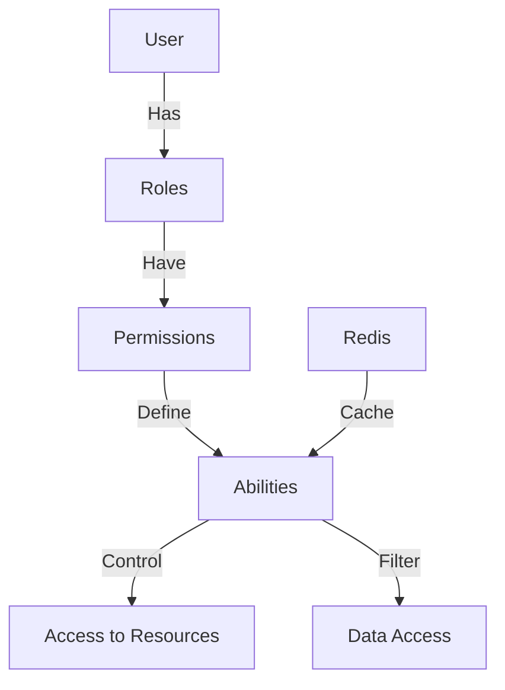
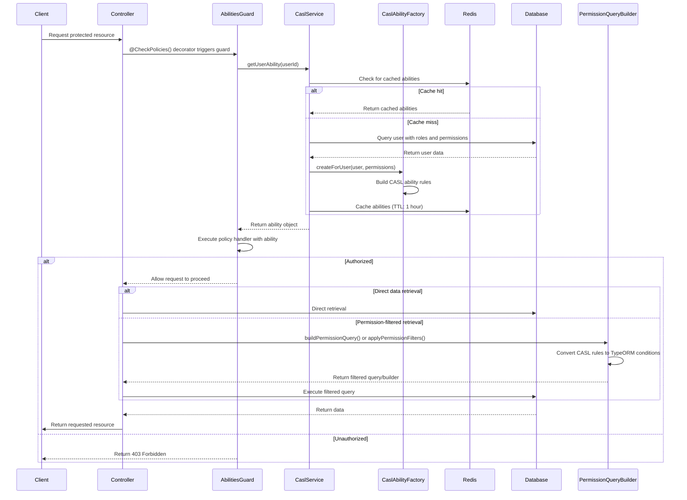

# CASL Authorization - Comprehensive Guide

This documentation provides a detailed reference for the enhanced CASL-based authorization system in our NestJS application.

## Table of Contents

- [CASL Authorization - Comprehensive Guide](#casl-authorization---comprehensive-guide)
  - [Table of Contents](#table-of-contents)
  - [Overview](#overview)
  - [Module Structure](#module-structure)
  - [Authorization Flow](#authorization-flow)
  - [Key Concepts](#key-concepts)
  - [Subject Types](#subject-types)
  - [Available Actions](#available-actions)
  - [Defining Permissions](#defining-permissions)
  - [Type-Safe Implementation](#type-safe-implementation)
    - [Actions as an Enum](#actions-as-an-enum)
    - [Subjects Definition](#subjects-definition)
    - [CASL Ability Factory](#casl-ability-factory)
  - [CASL Service](#casl-service)
    - [Cache Implementation](#cache-implementation)
    - [Permission Checking Methods](#permission-checking-methods)
  - [Permission Query Builder](#permission-query-builder)
    - [1. Direct Query Building](#1-direct-query-building)
    - [2. Applying Filters to QueryBuilder](#2-applying-filters-to-querybuilder)
    - [3. Permission-Filtered Repository](#3-permission-filtered-repository)
    - [Condition Processing](#condition-processing)
  - [Usage in Controllers](#usage-in-controllers)
    - [1. Using Guards and Decorators](#1-using-guards-and-decorators)
    - [2. Direct Permission Checks](#2-direct-permission-checks)
    - [3. Filtered Data Access](#3-filtered-data-access)
  - [Advanced Features](#advanced-features)
    - [Field-Level Permissions](#field-level-permissions)
    - [Condition Variables](#condition-variables)
    - [Custom Policy Handlers](#custom-policy-handlers)
  - [Caching Strategy](#caching-strategy)
    - [Cache Implementation](#cache-implementation-1)
    - [Cache Invalidation](#cache-invalidation)
    - [Cache Performance Tuning](#cache-performance-tuning)
  - [Role Management](#role-management)
  - [Best Practices](#best-practices)
  - [Testing CASL Permissions](#testing-casl-permissions)
  - [Future Enhancements](#future-enhancements)
  - [Debugging CASL Issues](#debugging-casl-issues)
  - [Integration with JWT Authentication](#integration-with-jwt-authentication)
  - [Appendix: Common Patterns and Recipes](#appendix-common-patterns-and-recipes)
    - [1. Owner-Based Permissions](#1-owner-based-permissions)
    - [2. Organization-Based Access](#2-organization-based-access)
    - [3. Advanced Permission Checks](#3-advanced-permission-checks)
    - [4. Handling Dynamic Permissions](#4-handling-dynamic-permissions)
    - [5. API Rate Limiting by Permission Level](#5-api-rate-limiting-by-permission-level)

## Overview

The authorization system uses CASL to provide attribute-based access control (ABAC) with fine-grained permissions. It integrates with NestJS, TypeORM, and Redis for a complete, high-performance authorization solution.



## Module Structure

The enhanced CASL module follows this structure:

```
src/
└── modules/
    └── casl/
        ├── types/                  # Type definitions
        │   ├── actions.ts          # Action enum definition
        │   └── subjects.ts         # Subject type definitions
        ├── decorators/             # Custom decorators
        │   ├── check-policies.decorator.ts
        │   └── ability.decorator.ts
        ├── guards/                 # Authorization guards
        │   └── abilities.guard.ts
        ├── services/               # Core services
        │   └── permission-query-builder.service.ts
        ├── casl-ability.factory.ts # Creates ability objects
        ├── casl.service.ts         # Main service with caching
        └── casl.module.ts          # Module definition
```

## Authorization Flow



## Key Concepts

- **Subjects**: Entities that can be acted upon (User, Article, Role, Permission, etc.)
- **Actions**: Operations that can be performed (create, read, update, delete, etc.)
- **Permissions**: Define what actions can be performed on which subjects
- **Roles**: Collections of permissions assigned to users
- **Abilities**: Determined by a user's roles and their associated permissions
- **Policies**: Functions that check if a user can perform an action on a resource
- **Conditions**: Dynamic rules that filter resources based on user context

## Subject Types

The system supports both class-based subjects and string-based subjects:

```typescript
export type Subjects = InferSubjects<
  | typeof User
  | typeof Article
  | typeof Permission
  | typeof Role
  | typeof File
  | 'Files' // String literal for non-entity subjects
  | 'all', // Special subject for global permissions
  true // Set to true to include subclasses
>;

// For string-based operations
export type SubjectString =
  | 'User'
  | 'Article'
  | 'Permission'
  | 'Role'
  | 'File'
  | 'Files'
  | 'all';
```

## Available Actions

The system defines these core actions as an enum for better type safety:

```typescript
export enum Action {
  SUPER_MODIFY = 'super-modify',
  MANAGE = 'manage',
  READ = 'read',
  UPDATE = 'update',
  DELETE = 'delete',
  CREATE = 'create',
  UPDATE_USER_ROLES = 'update-user-roles',
}
```

Each action has a specific purpose:

| Action              | Description                            |
| ------------------- | -------------------------------------- |
| `SUPER_MODIFY`      | Full system access                     |
| `MANAGE`            | Full access to a specific resource     |
| `CREATE`            | Create new instances of a resource     |
| `READ`              | View or list resources                 |
| `UPDATE`            | Modify existing resources              |
| `DELETE`            | Remove resources                       |
| `UPDATE_USER_ROLES` | Special permission for assigning roles |

## Defining Permissions

Permissions are created through the API and stored in the database. Each permission defines:

- **Action**: What can be done (from the `Action` enum)
- **Subject**: What it can be done to (e.g., 'User', 'Article')
- **Fields** (optional): Specific fields that can be acted upon
- **Conditions** (optional): Additional checks (e.g., only own articles)
- **Inverted** (boolean): Whether this is an allow or deny rule

Example permission configuration:

```json
{
  "action": "read",
  "subject": "Article",
  "fields": ["title", "content", "createdAt"],
  "conditions": { "authorId": "${user.id}" },
  "inverted": false
}
```

The permission entity structure:

```typescript
@Entity('permissions')
export class Permission {
  @PrimaryGeneratedColumn()
  id: number;

  @Column()
  action: string;

  @Column()
  subject: string;

  @Column({ type: 'jsonb', nullable: true })
  fields: string[];

  @Column({ type: 'jsonb', nullable: true })
  conditions: Record<string, any>;

  @Column({ default: false })
  inverted: boolean;

  @ManyToMany(() => Role, (role) => role.permissions)
  roles: Role[];
}
```

## Type-Safe Implementation

### Actions as an Enum

Using an enum for actions provides better type safety and IDE autocompletion:

```typescript
export enum Action {
  SUPER_MODIFY = 'super-modify',
  MANAGE = 'manage',
  READ = 'read',
  UPDATE = 'update',
  DELETE = 'delete',
  CREATE = 'create',
  UPDATE_USER_ROLES = 'update-user-roles',
}
```

### Subjects Definition

The `Subjects` type uses CASL's `InferSubjects` utility to create a union type of all possible subjects:

```typescript
import { InferSubjects } from '@casl/ability';
import { User } from '../entities/user.entity';
// ... other entity imports

export type Subjects = InferSubjects<
  | typeof User
  | typeof Article
  | typeof Permission
  | typeof Role
  | typeof File
  | 'Files'
  | 'all',
  true // true to include subclasses
>;
```

### CASL Ability Factory

The ability factory creates CASL ability objects, handling type issues with CASL's typing system:

```typescript
import { AbilityBuilder, PureAbility } from '@casl/ability';
// ... other imports

export type AppAbility = PureAbility<[Action | string, any]>;

@Injectable()
export class CaslAbilityFactory {
  createForUser(user: User, permissions: Permission[]): AppAbility {
    const { can, cannot, build } = new AbilityBuilder<AppAbility>(PureAbility);

    for (const permission of permissions) {
      const { action, subject, fields, conditions, inverted } = permission;

      if (inverted) {
        cannot(action, subject, fields || undefined, conditions || undefined);
      } else {
        can(action, subject, fields || undefined, conditions || undefined);
      }
    }

    // Default permissions (if any)

    return build({
      detectSubjectType: (item) => {
        if (typeof item === 'string') {
          return item;
        }
        return item.constructor;
      },
    });
  }
}
```

## CASL Service

The CASL service provides the core functionality, including ability retrieval and permission checking:

### Cache Implementation

The service implements Redis caching for performance:

```typescript
@Injectable()
export class CaslService {
  private readonly CACHE_TTL = 3600000; // 1 hour

  constructor(
    @Inject(CACHE_MANAGER) private cacheManager: Cache,
    @InjectRepository(User) private userRepository: Repository<User>,
    private caslAbilityFactory: CaslAbilityFactory,
  ) {}

  async getUserAbility(userId: string): Promise<AppAbility> {
    const cacheKey = `user_abilities_${userId}`;

    try {
      // Try to get from cache first
      let userAbility = await this.cacheManager.get<AppAbility>(cacheKey);

      if (!userAbility) {
        const user = await this.userRepository.findOne({
          where: { id: userId },
          relations: ['roles', 'roles.permissions'],
        });

        if (!user) {
          throw new Error(`User not found: ${userId}`);
        }

        const permissions = user.roles.flatMap((role) => role.permissions);
        userAbility = this.caslAbilityFactory.createForUser(user, permissions);

        // Cache for future requests
        await this.cacheManager.set(cacheKey, userAbility, this.CACHE_TTL);
      }

      return userAbility;
    } catch (error) {
      this.logger.error(`Error getting user abilities: ${error.message}`);
      throw error;
    }
  }

  async invalidateUserAbilitiesCache(userId: string): Promise<void> {
    const cacheKey = `user_abilities_${userId}`;
    await this.cacheManager.del(cacheKey);
  }
}
```

### Permission Checking Methods

The service provides convenience methods for checking permissions:

```typescript
async can(
  userId: string,
  action: Action | string,
  subject: any,
  field?: string,
): Promise<boolean> {
  const ability = await this.getUserAbility(userId);
  return field
    ? ability.can(action, subject, field)
    : ability.can(action, subject);
}

async cannot(
  userId: string,
  action: Action | string,
  subject: any,
  field?: string,
): Promise<boolean> {
  const ability = await this.getUserAbility(userId);
  return field
    ? ability.cannot(action, subject, field)
    : ability.cannot(action, subject);
}
```

## Permission Query Builder

The PermissionQueryBuilder provides three ways to apply permissions to data access:

### 1. Direct Query Building

Builds TypeORM `FindOptionsWhere` objects from CASL rules:

```typescript
async buildPermissionQuery<T>(
  userId: string,
  action: Action | string,
  entityName: string,
): Promise<FindOptionsWhere<T> | FindOptionsWhere<T>[]> {
  const ability = await this.caslService.getUserAbility(userId);

  // Get all rules that apply to this entity and action
  const rules = ability.rulesFor(action, entityName);

  // Process rules and return TypeORM conditions
  // ...
}

// Usage
const whereConditions = await permissionQueryBuilder.buildPermissionQuery<Article>(
  userId,
  Action.READ,
  'Article'
);

const articles = await articleRepository.find({ where: whereConditions });
```

### 2. Applying Filters to QueryBuilder

Adds WHERE conditions to an existing QueryBuilder:

```typescript
async applyPermissionFilters<T>(
  queryBuilder: SelectQueryBuilder<T>,
  userId: string,
  action: Action | string,
): Promise<SelectQueryBuilder<T>> {
  const ability = await this.caslService.getUserAbility(userId);
  const entityName = queryBuilder.expressionMap.mainAlias?.metadata?.name;
  const alias = queryBuilder.expressionMap.mainAlias?.name;

  // Process rules and add WHERE conditions
  // ...

  return queryBuilder;
}

// Usage
const queryBuilder = articleRepository.createQueryBuilder('article');
await permissionQueryBuilder.applyPermissionFilters(queryBuilder, userId, Action.READ);
const articles = await queryBuilder.getMany();
```

### 3. Permission-Filtered Repository

Creates a proxy repository that automatically applies permission filters:

```typescript
async createPermissionFilteredRepository<T>(
  repository: Repository<T>,
  userId: string,
  action: Action | string,
): Promise<Repository<T>> {
  // Create a proxy around the repository to intercept calls
  return new Proxy(repository, {
    get: (target, prop, receiver) => {
      // Intercept methods that need permission filtering
      if (prop === 'find' || prop === 'findOne' || prop === 'findAndCount') {
        return async (...args: any[]) => {
          const queryBuilder = repository.createQueryBuilder();
          await this.applyPermissionFilters(queryBuilder, userId, action);

          // Add conditions, pagination, ordering from original call
          // ...

          // Call the appropriate method
          if (prop === 'find') return queryBuilder.getMany();
          if (prop === 'findOne') return queryBuilder.getOne();
          if (prop === 'findAndCount') return queryBuilder.getManyAndCount();
        };
      }

      // For createQueryBuilder, return a function that applies permissions
      if (prop === 'createQueryBuilder') {
        return (...args: any[]) => {
          const qb = target[prop](...args);
          return this.applyPermissionFilters(qb, userId, action);
        };
      }

      // For all other methods, use the original
      return Reflect.get(target, prop, receiver);
    },
  });
}

// Usage
const filteredRepo = await permissionQueryBuilder.createPermissionFilteredRepository(
  articleRepository,
  userId,
  Action.READ
);

// Automatically applies permission filters
const articles = await filteredRepo.find();
```

### Condition Processing

The service handles complex conditions with operators:

```typescript
private processConditions(conditions: any, alias: string): string {
  const clauses: string[] = [];

  for (const [key, value] of Object.entries(conditions)) {
    if (value === null) {
      clauses.push(`${alias}.${key} IS NULL`);
    } else if (typeof value === 'object' && !Array.isArray(value)) {
      // Handle operators like $eq, $ne, $in, etc.
      for (const [op, opValue] of Object.entries(value)) {
        switch (op) {
          case '$eq':
            clauses.push(`${alias}.${key} = ${this.formatValue(opValue)}`);
            break;
          case '$ne':
            clauses.push(`${alias}.${key} != ${this.formatValue(opValue)}`);
            break;
          case '$gt':
            clauses.push(`${alias}.${key} > ${this.formatValue(opValue)}`);
            break;
          // ... other operators
        }
      }
    } else {
      // Simple equality
      clauses.push(`${alias}.${key} = ${this.formatValue(value)}`);
    }
  }

  return clauses.join(' AND ');
}
```

Supports these operators:

| Operator | Meaning               | SQL Equivalent |
| -------- | --------------------- | -------------- |
| $eq      | Equal                 | =              |
| $ne      | Not equal             | !=             |
| $gt      | Greater than          | >              |
| $gte     | Greater than or equal | >=             |
| $lt      | Less than             | <              |
| $lte     | Less than or equal    | <=             |
| $in      | In array              | IN (values)    |

## Usage in Controllers

### 1. Using Guards and Decorators

The simplest way to protect endpoints is using guards and decorators:

```typescript
@Controller('articles')
@UseGuards(JwtAuthGuard, AbilitiesGuard)
export class ArticleController {
  constructor(
    private articlesService: ArticleService,
    private caslService: CaslService,
  ) {}

  @Post()
  @CheckPolicies((ability: AppAbility) => ability.can(Action.CREATE, 'Article'))
  create(@Body() createArticleDto: CreateArticleDto, @Request() req) {
    return this.articlesService.create(createArticleDto, req.user.id);
  }

  @Get(':id')
  @CheckPolicies((ability: AppAbility) => ability.can(Action.READ, 'Article'))
  findOne(@Param('id') id: string) {
    return this.articlesService.findOne(+id);
  }
}
```

For convenience, you can create custom decorators:

```typescript
export const CanRead = (subject: SubjectString) =>
  CheckPolicies((ability: AppAbility) => ability.can(Action.READ, subject));

export const CanCreate = (subject: SubjectString) =>
  CheckPolicies((ability: AppAbility) => ability.can(Action.CREATE, subject));

// Using them in controllers
@Get()
@CanRead('Article')
findAll() {
  // ...
}
```

### 2. Direct Permission Checks

For more complex scenarios, check permissions directly in services:

```typescript
async updateArticle(id: number, updateDto: UpdateArticleDto, userId: string) {
  const article = await this.articleRepository.findOne({
    where: { id },
    relations: ['author'],
  });

  if (!article) {
    throw new NotFoundException('Article not found');
  }

  // Check permissions
  const canUpdate = await this.caslService.can(
    userId,
    Action.UPDATE,
    article
  );

  if (!canUpdate) {
    throw new ForbiddenException('You cannot update this article');
  }

  // Proceed with update
  Object.assign(article, updateDto);
  return this.articleRepository.save(article);
}
```

### 3. Filtered Data Access

For listing operations, use the PermissionQueryBuilder:

```typescript
async findAll(
  pagination: PaginationDto,
  userId: string
): Promise<PaginatedResponse<Article>> {
  const { page, limit } = pagination;

  // Build query with permission filters
  const queryBuilder = this.articleRepository.createQueryBuilder('article');
  await this.permissionQueryBuilder.applyPermissionFilters(
    queryBuilder,
    userId,
    Action.READ
  );

  // Add additional filters, pagination, etc.
  queryBuilder
    .leftJoinAndSelect('article.author', 'author')
    .skip((page - 1) * limit)
    .take(limit)
    .orderBy('article.createdAt', 'DESC');

  const [articles, total] = await queryBuilder.getManyAndCount();

  return {
    data: articles,
    meta: {
      total,
      page,
      limit,
      totalPages: Math.ceil(total / limit),
    }
  };
}
```

## Advanced Features

### Field-Level Permissions

Control access to specific fields:

```typescript
// Permission definition
{
  "action": "read",
  "subject": "User",
  "fields": ["id", "firstName", "lastName", "email"]
}

// Service implementation
async getUserProfile(userId: string, requesterId: string) {
  const user = await this.userRepository.findOne({ where: { id: userId } });

  if (!user) {
    throw new NotFoundException('User not found');
  }

  // Get the ability object
  const ability = await this.caslService.getUserAbility(requesterId);

  // Get allowed fields
  const readableFields = this.extractAllowedFields(ability, Action.READ, 'User');

  // Return only allowed fields
  return this.filterFields(user, readableFields);
}

private extractAllowedFields(ability: AppAbility, action: Action, subject: string): string[] {
  const rules = ability.rulesFor(action, subject);
  return rules
    .filter(rule => !rule.inverted && rule.fields)
    .flatMap(rule => rule.fields || [])
    .filter(field => field !== '*');
}

private filterFields<T>(object: T, allowedFields: string[]): Partial<T> {
  if (allowedFields.includes('*')) {
    return object;
  }

  return Object.fromEntries(
    Object.entries(object)
      .filter(([key]) => allowedFields.includes(key))
  ) as Partial<T>;
}
```

### Condition Variables

Use variables in conditions for dynamic filtering:

```typescript
// Permission with a variable
{
  "action": "read",
  "subject": "Article",
  "conditions": { "authorId": "${user.id}" }
}

// The processVariables function in PermissionQueryBuilder replaces these
private processVariables(obj: Record<string, any>, user: User): void {
  for (const [key, value] of Object.entries(obj)) {
    if (typeof value === 'object' && value !== null) {
      this.processVariables(value, user);
    } else if (typeof value === 'string' && value.includes('${user.')) {
      const match = value.match(/\${(.*?)}/);
      if (match) {
        const path = match[1];
        obj[key] = _.get({ user }, path);
      }
    }
  }
}
```

Available variables:

- `${user.id}` - The current user's ID
- `${user.email}` - The current user's email
- `${user.roleIds}` - Array of the user's role IDs
- Any user property can be accessed with `${user.propertyName}`

### Custom Policy Handlers

Define complex permission logic with custom policy handlers:

```typescript
// Define a policy handler class
export class ArticleOwnerPolicy implements PolicyHandler {
  handle(ability: AppAbility): boolean {
    return ability.can(Action.UPDATE, 'Article') ||
           ability.can(Action.MANAGE, 'Article');
  }
}

// Using class-based policy handlers
@Put(':id')
@CheckPolicies(new ArticleOwnerPolicy())
update(@Param('id') id: string, @Body() updateArticleDto: UpdateArticleDto) {
  return this.articlesService.update(+id, updateArticleDto);
}

// Or combine multiple handlers
@Delete(':id')
@CheckPolicies(
  (ability: AppAbility) => ability.can(Action.DELETE, 'Article'),
  new ArticleOwnerPolicy()
)
remove(@Param('id') id: string) {
  return this.articlesService.remove(+id);
}
```

## Caching Strategy

### Cache Implementation

The system uses Redis for caching user abilities:

```typescript
// In CaslService
async getUserAbility(userId: string): Promise<AppAbility> {
  const cacheKey = `user_abilities_${userId}`;

  // Try cache first
  let userAbility = await this.cacheManager.get<AppAbility>(cacheKey);

  if (!userAbility) {
    // Cache miss logic
    // ...

    // Store in cache
    await this.cacheManager.set(cacheKey, userAbility, this.CACHE_TTL);
  }

  return userAbility;
}
```

Cache configuration in your module:

```typescript
@Module({
  imports: [
    CacheModule.registerAsync({
      imports: [ConfigModule],
      inject: [ConfigService],
      useFactory: (configService: ConfigService) => ({
        store: redisStore,
        host: configService.get('REDIS_HOST'),
        port: configService.get('REDIS_PORT'),
        ttl: 3600, // 1 hour in seconds
      }),
    }),
    // Other imports
  ],
  // ...
})
export class AppModule {}
```

### Cache Invalidation

Invalidate cache when permissions change:

```typescript
// In RoleService
async updateRole(id: number, updateRoleDto: UpdateRoleDto): Promise<Role> {
  const role = await this.roleRepository.findOne({
    where: { id },
    relations: ['users'],
  });

  if (!role) {
    throw new NotFoundException(`Role with ID ${id} not found`);
  }

  // Update role
  Object.assign(role, updateRoleDto);
  const updatedRole = await this.roleRepository.save(role);

  // Invalidate cache for all affected users
  for (const user of role.users) {
    await this.caslService.invalidateUserAbilitiesCache(user.id);
  }

  return updatedRole;
}

// In UserService when roles change
async updateUserRoles(userId: string, roleIds: number[]): Promise<User> {
  // Update user roles logic
  // ...

  // Invalidate cache
  await this.caslService.invalidateUserAbilitiesCache(userId);

  return user;
}
```

### Cache Performance Tuning

Tips for optimizing the cache:

1. **Adjustable TTL**: Configure different TTL values based on user types:

```typescript
// For admins, use a shorter TTL since their permissions are more critical
const ttl = user.hasRole('admin') ? 1800000 : 3600000; // 30 min vs 60 min
await this.cacheManager.set(cacheKey, userAbility, ttl);
```

2. **Batch Invalidation**: For operations affecting many users:

```typescript
async invalidateRoleCaches(roleId: number): Promise<void> {
  const users = await this.userRepository
    .createQueryBuilder('user')
    .innerJoin('user.roles', 'role', 'role.id = :roleId', { roleId })
    .getMany();

  const promises = users.map(user =>
    this.invalidateUserAbilitiesCache(user.id)
  );

  await Promise.all(promises);
}
```

3. **Cache Versioning**: Add version to cache keys for global invalidation:

```typescript
// Add to your ConfigService
private cacheVersion = 1;

getCacheVersion(): number {
  return this.cacheVersion;
}

incrementCacheVersion(): void {
  this.cacheVersion++;
}

// In CaslService
async getUserAbility(userId: string): Promise<AppAbility> {
  const version = this.configService.getCacheVersion();
  const cacheKey = `user_abilities_v${version}_${userId}`;
  // ...
}

// To invalidate all caches at once
async invalidateAllCaches(): Promise<void> {
  this.configService.incrementCacheVersion();
}
```

## Role Management

Roles are assigned through the API, with each role containing permissions:

```typescript
@Entity('roles')
export class Role {
  @PrimaryGeneratedColumn()
  id: number;

  @Column({ unique: true })
  name: string;

  @Column({ nullable: true })
  description: string;

  @ManyToMany(() => Permission, (permission) => permission.roles, {
    cascade: true,
  })
  @JoinTable()
  permissions: Permission[];

  @ManyToMany(() => User, (user) => user.roles)
  users: User[];
}
```

Creating a new role with permissions:

```typescript
// In RoleService
async create(createRoleDto: CreateRoleDto): Promise<Role> {
  // Extract permission IDs from DTO
  const { name, description, permissionIds } = createRoleDto;

  // Create new role entity
  const role = new Role();
  role.name = name;
  role.description = description;

  // Find permissions if provided
  if (permissionIds && permissionIds.length > 0) {
    role.permissions = await this.permissionRepository.findBy({
      id: In(permissionIds),
    });
  } else {
    role.permissions = [];
  }

  // Save the role
  return this.roleRepository.save(role);
}
```

Assigning roles to users:

```typescript
// In UserService
async assignRolesToUser(userId: string, roleIds: number[]): Promise<User> {
  const user = await this.userRepository.findOne({
    where: { id: userId },
    relations: ['roles'],
  });

  if (!user) {
    throw new NotFoundException(`User with ID ${userId} not found`);
  }

  // Find roles by IDs
  const roles = await this.roleRepository.findBy({
    id: In(roleIds),
  });

  // Assign roles to user
  user.roles = roles;
  const updatedUser = await this.userRepository.save(user);

  // Invalidate the user's ability cache
  await this.caslService.invalidateUserAbilitiesCache(userId);

  return updatedUser;
}
```

## Best Practices

1. **Layer Your Authorization**:

   - API layer: Use `@CheckPolicies()` decorator
   - Service layer: Use `caslService.can()` for explicit checks
   - Data layer: Use `permissionQueryBuilder` to filter data automatically

2. **Use Custom Decorators** for common permission patterns:

   ```typescript
   export const CanManage = (subject: SubjectString) =>
     CheckPolicies((ability: AppAbility) =>
       ability.can(Action.MANAGE, subject),
     );

   export const AdminOnly = () =>
     CheckPolicies((ability: AppAbility) =>
       ability.can(Action.SUPER_MODIFY, 'all'),
     );
   ```

3. **Prefer Class-Based Subjects** over string literals when possible:

   ```typescript
   // Better - allows TypeScript to help with property names
   ability.can(Action.UPDATE, Article);

   // Instead of
   ability.can(Action.UPDATE, 'Article');
   ```

4. **Field-Level Validation** in services:

   ```typescript
   // Check if user can update specific fields
   for (const field of Object.keys(updateUserDto)) {
     if (await this.caslService.cannot(userId, Action.UPDATE, 'User', field)) {
       throw new ForbiddenException(`You cannot update the ${field} field`);
     }
   }
   ```

5. **Combine with DTO Validation**:

   ```typescript
   // Filter DTO based on permissions
   async filterUpdateUserDto(
     dto: UpdateUserDto,
     userId: string
   ): Promise<Partial<UpdateUserDto>> {
     const ability = await this.caslService.getUserAbility(userId);

     return Object.fromEntries(
       Object.entries(dto).filter(([key]) =>
         ability.can(Action.UPDATE, 'User', key)
       )
     ) as Partial<UpdateUserDto>;
   }
   ```

6. **Default to Denial**: System denies by default; explicitly allow actions.

7. **Hierarchical Permissions**: Use permissions hierarchy:

   ```
   super-modify > manage > [create, read, update, delete]
   ```

   Checking for higher permission first:

   ```typescript
   // In a policy handler
   handle(ability: AppAbility): boolean {
     return ability.can(Action.SUPER_MODIFY, 'all') ||
            ability.can(Action.MANAGE, 'Article') ||
            ability.can(Action.UPDATE, 'Article');
   }
   ```

8. **Avoid Over-Complicated Conditions**:

   ```typescript
   // Too complex - hard to maintain
   {
     "action": "read",
     "subject": "Article",
     "conditions": {
       "$or": [
         { "authorId": "${user.id}" },
         {
           "status": "published",
           "visibility": "public"
         }
       ]
     }
   }

   // Better - split into separate permissions
   [
     {
       "action": "read",
       "subject": "Article",
       "conditions": { "authorId": "${user.id}" }
     },
     {
       "action": "read",
       "subject": "Article",
       "conditions": { "status": "published", "visibility": "public" }
     }
   ]
   ```

9. **Cache Invalidation Strategy**: Plan when to invalidate:

   - When user roles change
   - When roles' permissions change
   - When user attributes referenced in conditions change

10. **Transaction Safety**:

    ```typescript
    // Ensure role updates and cache invalidation happen atomically
    async updateRolePermissions(
      roleId: number,
      permissionIds: number[]
    ): Promise<Role> {
      return this.dataSource.transaction(async manager => {
        const roleRepo = manager.getRepository(Role);
        const permissionRepo = manager.getRepository(Permission);

        const role = await roleRepo.findOne({
          where: { id: roleId },
          relations: ['permissions', 'users'],
        });

        const permissions = await permissionRepo.findBy({
          id: In(permissionIds)
        });

        role.permissions = permissions;
        const updatedRole = await roleRepo.save(role);

        // Invalidate all affected user caches
        for (const user of role.users) {
          await this.caslService.invalidateUserAbilitiesCache(user.id);
        }

        return updatedRole;
      });
    }
    ```

## Testing CASL Permissions

Unit testing permission rules:

```typescript
describe('ArticlePolicies', () => {
  let caslAbilityFactory: CaslAbilityFactory;
  let permissionRepository: Repository<Permission>;

  beforeEach(async () => {
    // Test module setup
    const module = await Test.createTestingModule({
      imports: [TypeOrmModule.forFeature([Permission])],
      providers: [CaslAbilityFactory],
    }).compile();

    caslAbilityFactory = module.get<CaslAbilityFactory>(CaslAbilityFactory);
    permissionRepository = module.get<Repository<Permission>>(
      getRepositoryToken(Permission),
    );
  });

  it('should allow authors to update their own articles', async () => {
    // Create test user and permissions
    const user = { id: '123', roles: [] };
    const permissions = [
      {
        id: 1,
        action: Action.UPDATE,
        subject: 'Article',
        conditions: { authorId: '${user.id}' },
        inverted: false,
      },
    ];

    // Create ability
    const ability = caslAbilityFactory.createForUser(
      user,
      permissions as Permission[],
    );

    // Test with an article the user owns
    const ownArticle = { id: 1, authorId: '123', title: 'My Article' };
    expect(ability.can(Action.UPDATE, ownArticle)).toBe(true);

    // Test with an article the user doesn't own
    const otherArticle = { id: 2, authorId: '456', title: 'Other Article' };
    expect(ability.can(Action.UPDATE, otherArticle)).toBe(false);
  });
});
```

Integration testing with E2E tests:

```typescript
describe('Articles Controller (e2e)', () => {
  let app: INestApplication;
  let authToken: string;

  beforeAll(async () => {
    const moduleFixture = await Test.createTestingModule({
      imports: [AppModule],
    }).compile();

    app = moduleFixture.createNestApplication();
    await app.init();

    // Login to get auth token
    const response = await request(app.getHttpServer())
      .post('/auth/login')
      .send({ email: 'author@example.com', password: 'password' })
      .expect(200);

    authToken = response.body.accessToken;
  });

  it('should create an article when authorized', () => {
    return request(app.getHttpServer())
      .post('/articles')
      .set('Authorization', `Bearer ${authToken}`)
      .send({
        title: 'Test Article',
        content: 'This is a test article',
      })
      .expect(201);
  });

  it("should return 403 when updating another user's article", async () => {
    // Create an article as a different user first
    // ...

    return request(app.getHttpServer())
      .put(`/articles/${otherUserArticleId}`)
      .set('Authorization', `Bearer ${authToken}`)
      .send({
        title: 'Updated Title',
      })
      .expect(403);
  });
});
```

## Future Enhancements

Potential improvements to the CASL system:

1. **GraphQL Integration**: Extend to work with GraphQL resolvers:

   ```typescript
   // Example future implementation
   @Resolver(() => Article)
   export class ArticleResolver {
     @Query(() => [Article])
     @CheckPolicies((ability: AppAbility) =>
       ability.can(Action.READ, 'Article'),
     )
     async articles(@CurrentUser() user: User) {
       const filteredRepo =
         await this.permissionQueryBuilder.createPermissionFilteredRepository(
           this.articleRepository,
           user.id,
           Action.READ,
         );

       return filteredRepo.find();
     }
   }
   ```

2. **Role Inheritance**: Implement role hierarchy:

   ```typescript
   // Future Role entity enhancement
   @Entity('roles')
   export class Role {
     // ... existing fields

     @ManyToOne(() => Role, { nullable: true })
     parent: Role;

     @OneToMany(() => Role, (role) => role.parent)
     children: Role[];
   }
   ```

3. **Permission Templates**: Create reusable permission sets:

   ```typescript
   // Example future implementation
   interface PermissionTemplate {
     name: string;
     description: string;
     permissions: Partial<Permission>[];
   }

   const contentEditorTemplate: PermissionTemplate = {
     name: 'Content Editor',
     description: 'Standard permissions for content editors',
     permissions: [
       { action: Action.CREATE, subject: 'Article' },
       { action: Action.READ, subject: 'Article' },
       {
         action: Action.UPDATE,
         subject: 'Article',
         conditions: { authorId: '${user.id}' },
       },
       {
         action: Action.DELETE,
         subject: 'Article',
         conditions: { authorId: '${user.id}' },
       },
     ],
   };
   ```

4. **Permission Impact Analysis**: Tool to analyze permission changes:

   ```typescript
   // Example future implementation
   async analyzePermissionImpact(permissionId: number): Promise<{
     rolesAffected: number;
     usersAffected: number;
     endpoints: string[];
   }> {
     // Query to find all roles using this permission
     // Count users with these roles
     // Analyze API endpoints affected
   }
   ```

5. **Condition Builder UI**: Frontend tool to build conditions visually.

6. **Advanced Condition Variables**: Support more dynamic variables:

   ```typescript
   // Future enhancement examples
   {
     "conditions": {
       "organizationId": "${user.organizationId}",
       "createdAt": { "$gt": "${now - 30d}" },
       "status": "${context.status}"
     }
   }
   ```

7. **Real-time Permission Updates**: Using WebSockets for immediate updates:

   ```typescript
   // Future implementation
   @WebSocketGateway()
   export class PermissionGateway {
     @WebSocketServer()
     server: Server;

     notifyPermissionChange(userId: string) {
       this.server.to(`user_${userId}`).emit('permissions_changed');
     }
   }
   ```

8. **Permission Auditing**: Log permission checks for compliance:

   ```typescript
   // Future implementation in CaslService
   async can(userId: string, action: Action, subject: any, field?: string): Promise<boolean> {
     const result = await super.can(userId, action, subject, field);

     await this.auditLogger.log({
       userId,
       action,
       subject: typeof subject === 'string' ? subject : subject.constructor.name,
       targetId: subject.id,
       field,
       allowed: result,
       timestamp: new Date(),
     });

     return result;
   }
   ```

## Debugging CASL Issues

Troubleshooting permission problems:

1. **Enable Debug Logging**:

   ```typescript
   // In CaslService
   @Injectable()
   export class CaslService {
     private readonly logger = new Logger(CaslService.name);

     constructor() {
       this.logger.setLogLevels(['debug']);
     }

     async can(userId: string, action: Action, subject: any): Promise<boolean> {
       const ability = await this.getUserAbility(userId);
       const result = ability.can(action, subject);

       this.logger.debug(
         `Permission check: User ${userId} | Action: ${action} | ` +
           `Subject: ${typeof subject === 'string' ? subject : subject.constructor.name} | ` +
           `Result: ${result}`,
       );

       return result;
     }
   }
   ```

2. **Debug Rules Manually**:

   ```typescript
   // Helper method to debug why permission was denied
   async explainPermission(
     userId: string,
     action: Action,
     subject: any
   ): Promise<string> {
     const ability = await this.getUserAbility(userId);
     const rules = ability.rulesFor(action, typeof subject === 'string' ? subject : subject.constructor.name);

     if (rules.length === 0) {
       return `No rules found for ${action} on ${typeof subject === 'string' ? subject : subject.constructor.name}`;
     }

     const relevantRules = rules.map(rule => ({
       inverted: rule.inverted,
       conditions: rule.conditions,
       fields: rule.fields,
       matches: this.checkConditions(rule, subject),
     }));

     return JSON.stringify(relevantRules, null, 2);
   }

   private checkConditions(rule: any, subject: any): boolean {
     if (!rule.conditions || typeof subject === 'string') {
       return true;
     }

     // Check if each condition matches the subject
     for (const [key, value] of Object.entries(rule.conditions)) {
       if (subject[key] !== value) {
         return false;
       }
     }

     return true;
   }
   ```

3. **Test Permission Matrix**:

```typescript
// Utility to check all permissions for a user
async generatePermissionMatrix(userId: string): Promise<Record<string, Record<string, boolean>>> {
  const ability = await this.getUserAbility(userId);
  const allSubjects = [
    'User', 'Article', 'Permission', 'Role', 'File', 'all'
  ];
  const allActions = Object.values(Action);

  const matrix: Record<string, Record<string, boolean>> = {};

  for (const subject of allSubjects) {
    matrix[subject] = {};

    for (const action of allActions) {
      matrix[subject][action] = ability.can(action, subject);
    }
  }

  return matrix;
}
```

1. **Permission Health Check Endpoint**:

```typescript
@Controller('debug')
@UseGuards(JwtAuthGuard)
@ApiTags('debug')
export class DebugController {
  constructor(private caslService: CaslService) {}

  @Get('permissions')
  @AdminOnly()
  async checkPermissions(@Request() req) {
    const userId = req.user.id;

    return {
      matrix: await this.caslService.generatePermissionMatrix(userId),
      cacheStatus: await this.caslService.getCacheStatus(userId),
      userRoles: await this.getUserRoles(userId),
    };
  }

  @Get('explain-permission')
  @AdminOnly()
  async explainPermission(
    @Query('action') action: Action,
    @Query('subject') subject: string,
    @Query('userId') userId: string,
  ) {
    return this.caslService.explainPermission(userId, action, subject);
  }

  private async getUserRoles(userId: string) {
    // Fetch and return user roles with their permissions
  }
}
```

## Integration with JWT Authentication

The CASL system integrates with JWT authentication through guards:

```typescript
// JWT strategy extracts and validates the user
@Injectable()
export class JwtStrategy extends PassportStrategy(Strategy) {
  constructor(
    private configService: ConfigService,
    @InjectRepository(User) private userRepository: Repository<User>,
  ) {
    super({
      jwtFromRequest: ExtractJwt.fromAuthHeaderAsBearerToken(),
      ignoreExpiration: false,
      secretOrKey: configService.get<string>('JWT_SECRET'),
    });
  }

  async validate(payload: any) {
    const user = await this.userRepository.findOne({
      where: { id: payload.sub },
    });

    if (!user) {
      throw new UnauthorizedException('User not found');
    }

    return user;
  }
}

// AbilitiesGuard uses the authenticated user from JWT
@Injectable()
export class AbilitiesGuard implements CanActivate {
  constructor(
    private reflector: Reflector,
    private caslService: CaslService,
  ) {}

  async canActivate(context: ExecutionContext): Promise<boolean> {
    const policyHandlers =
      this.reflector.get<PolicyHandler[]>(
        CHECK_POLICIES_KEY,
        context.getHandler(),
      ) || [];

    if (policyHandlers.length === 0) {
      return true; // No policies to check
    }

    const { user } = context.switchToHttp().getRequest();
    if (!user) {
      return false; // No user, no access
    }

    const ability = await this.caslService.getUserAbility(user.id);

    return policyHandlers.every((handler) =>
      this.execPolicyHandler(handler, ability),
    );
  }

  private execPolicyHandler(handler: PolicyHandler, ability: AppAbility) {
    if (typeof handler === 'function') {
      return handler(ability);
    }
    return handler.handle(ability);
  }
}
```

Using both guards together:

```typescript
@Controller('articles')
@UseGuards(JwtAuthGuard, AbilitiesGuard) // Order matters
export class ArticleController {
  // Protected endpoints
}
```

Creating a combined authentication/authorization decorator:

```typescript
export function SecureResource(subject: SubjectString, action: Action) {
  return applyDecorators(
    UseGuards(JwtAuthGuard, AbilitiesGuard),
    CheckPolicies((ability: AppAbility) => ability.can(action, subject)),
    ApiBearerAuth(),
    ApiUnauthorizedResponse({ description: 'Unauthorized' }),
    ApiForbiddenResponse({ description: 'Forbidden resource' }),
  );
}

// Usage
@Post()
@SecureResource('Article', Action.CREATE)
create(@Body() createArticleDto: CreateArticleDto) {
  // ...
}
```

## Appendix: Common Patterns and Recipes

### 1. Owner-Based Permissions

Allow users to manage only their own resources:

```typescript
// Permission definition
{
  "action": "manage",
  "subject": "Article",
  "conditions": { "authorId": "${user.id}" }
}

// DTO for creating resources that includes ownership
@Injectable()
export class ArticleService {
  async create(createArticleDto: CreateArticleDto, userId: string): Promise<Article> {
    const article = new Article();
    Object.assign(article, createArticleDto);
    article.authorId = userId; // Assign ownership

    return this.articleRepository.save(article);
  }
}
```

### 2. Organization-Based Access

Restrict access to resources within the same organization:

```typescript
// Permission definition
{
  "action": "read",
  "subject": "User",
  "conditions": { "organizationId": "${user.organizationId}" }
}

// In service
async findUsersInSameOrganization(userId: string) {
  const filteredRepo = await this.permissionQueryBuilder.createPermissionFilteredRepository(
    this.userRepository,
    userId,
    Action.READ
  );

  return filteredRepo.find();
}
```

### 3. Advanced Permission Checks

For complex permission scenarios:

```typescript
// Service with combined rules
async createCommentOnArticle(
  articleId: number,
  createCommentDto: CreateCommentDto,
  userId: string
): Promise<Comment> {
  // First check if article exists
  const article = await this.articleRepository.findOne({
    where: { id: articleId }
  });

  if (!article) {
    throw new NotFoundException('Article not found');
  }

  // Multiple permission checks
  const ability = await this.caslService.getUserAbility(userId);

  // 1. Can user read the article?
  if (ability.cannot(Action.READ, article)) {
    throw new ForbiddenException('You cannot view this article');
  }

  // 2. Can user create comments?
  if (ability.cannot(Action.CREATE, 'Comment')) {
    throw new ForbiddenException('You cannot create comments');
  }

  // 3. Is the article open for comments?
  if (!article.allowComments) {
    throw new ForbiddenException('This article does not allow comments');
  }

  // If all checks pass, create the comment
  const comment = new Comment();
  comment.content = createCommentDto.content;
  comment.articleId = articleId;
  comment.authorId = userId;

  return this.commentRepository.save(comment);
}
```

### 4. Handling Dynamic Permissions

For permissions that depend on resource state:

```typescript
// Create a custom ability helper
export class ArticleAbilityHelper {
  static canPublish(user: User, article: Article): boolean {
    // Check if article is in draft state
    if (article.status !== 'draft') {
      return false;
    }

    // Only author can publish their own drafts
    if (article.authorId !== user.id) {
      return false;
    }

    // Check minimum word count
    if (article.wordCount < 100) {
      return false;
    }

    return true;
  }
}

// Use in a policy handler
@Put(':id/publish')
@CheckPolicies(
  (ability: AppAbility) => ability.can(Action.UPDATE, 'Article'),
  async (ability: AppAbility, context: ExecutionContext) => {
    const request = context.switchToHttp().getRequest();
    const { user } = request;
    const articleId = request.params.id;

    // Get article from database
    const articleService = context.getContextByKey('ArticleService');
    const article = await articleService.findOne(articleId);

    if (!article) return false;

    // Check dynamic publishing rules
    return ArticleAbilityHelper.canPublish(user, article);
  }
)
publish(@Param('id') id: string) {
  return this.articlesService.publish(+id);
}
```

### 5. API Rate Limiting by Permission Level

Integrate permissions with rate limiting:

```typescript
@Injectable()
export class PermissionBasedThrottlerGuard extends ThrottlerGuard {
  constructor(
    throttlerService: ThrottlerService,
    private caslService: CaslService,
  ) {
    super(throttlerService);
  }

  async handleRequest(
    context: ExecutionContext,
    limit: number,
    ttl: number,
  ): Promise<boolean> {
    const { user } = context.switchToHttp().getRequest();

    if (user) {
      const ability = await this.caslService.getUserAbility(user.id);

      // Different rate limits based on permissions
      if (ability.can(Action.SUPER_MODIFY, 'all')) {
        // Admins get higher limits
        limit = limit * 5;
      } else if (ability.can(Action.MANAGE, 'Article')) {
        // Editors get medium limits
        limit = limit * 2;
      }
    }

    // Use adjusted limit
    return super.handleRequest(context, limit, ttl);
  }
}
```

---

This documentation provides a comprehensive guide to the enhanced CASL authorization system. By leveraging these features and following the best practices, you can implement a secure, performant, and maintainable permission system that scales with your application's needs.

For future development, consider the enhancements described in the [Future Enhancements](#future-enhancements) section, especially role inheritance and permission templates which would make the system even more flexible and powerful.
