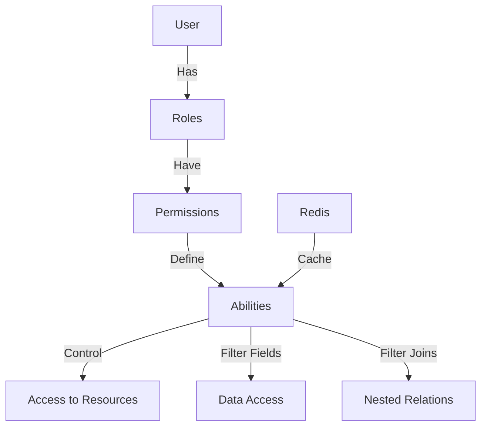
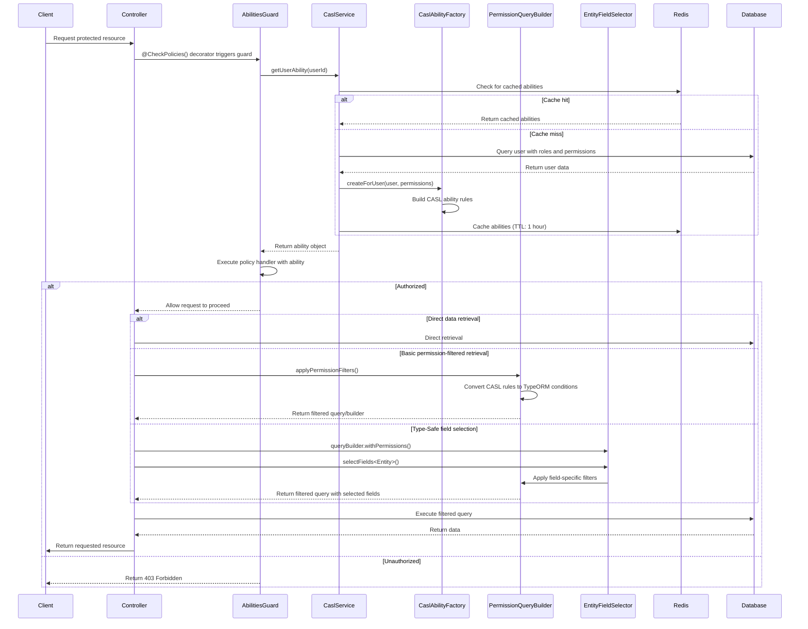

# CASL Authorization - Comprehensive Guide

This documentation provides a detailed reference for the enhanced CASL-based authorization system in our NestJS application.

## Table of Contents

- [CASL Authorization - Comprehensive Guide](#casl-authorization---comprehensive-guide)
  - [Table of Contents](#table-of-contents)
  - [Overview](#overview)
  - [Module Structure](#module-structure)
  - [Authorization Flow](#authorization-flow)
  - [Key Concepts](#key-concepts)
  - [Subject Types](#subject-types)
  - [Available Actions](#available-actions)
  - [Defining Permissions](#defining-permissions)
  - [Type-Safe Implementation](#type-safe-implementation)
    - [Actions as an Enum](#actions-as-an-enum)
    - [Subjects Definition](#subjects-definition)
    - [CASL Ability Factory](#casl-ability-factory)
  - [CASL Service](#casl-service)
    - [Cache Implementation](#cache-implementation)
    - [Permission Checking Methods](#permission-checking-methods)
  - [Permission Query Builder](#permission-query-builder)
    - [1. Direct Query Building](#1-direct-query-building)
    - [2. Applying Filters to QueryBuilder](#2-applying-filters-to-querybuilder)
    - [3. Type-Safe Field Selection API](#3-type-safe-field-selection-api)
    - [4. Permission-Filtered Repository](#4-permission-filtered-repository)
    - [Condition Processing](#condition-processing)
  - [Usage in Controllers](#usage-in-controllers)
    - [1. Using Guards and Decorators](#1-using-guards-and-decorators)
    - [2. Direct Permission Checks](#2-direct-permission-checks)
    - [3. Filtered Data Access](#3-filtered-data-access)
    - [4. Type-Safe Field Selection](#4-type-safe-field-selection)
  - [Advanced Features](#advanced-features)
    - [Field-Level Permissions](#field-level-permissions)
    - [Nested Entity Permissions](#nested-entity-permissions)
    - [Condition Variables](#condition-variables)
    - [Custom Policy Handlers](#custom-policy-handlers)
  - [Caching Strategy](#caching-strategy)
  - [Role Management](#role-management)
  - [Best Practices](#best-practices)
  - [Testing CASL Permissions](#testing-casl-permissions)
  - [Future Enhancements](#future-enhancements)
  - [Debugging CASL Issues](#debugging-casl-issues)
  - [Integration with JWT Authentication](#integration-with-jwt-authentication)
  - [Appendix: Common Patterns and Recipes](#appendix-common-patterns-and-recipes)
    - [1. Global Admin Access](#1-global-admin-access)
    - [2. Ownership-Based Access](#2-ownership-based-access)
    - [3. Field-Based Conditions](#3-field-based-conditions)
    - [4. Type-Safe Field Selection for DTOs](#4-type-safe-field-selection-for-dtos)
    - [5. Multi-Tenant Permissions](#5-multi-tenant-permissions)
    - [6. Using Ability with Repository Pattern](#6-using-ability-with-repository-pattern)
    - [7. Handling Dynamic Resources](#7-handling-dynamic-resources)
    - [8. Permission-Based UI Adaptation](#8-permission-based-ui-adaptation)

## Overview

The authorization system uses CASL to provide attribute-based access control (ABAC) with fine-grained permissions. It integrates with NestJS, TypeORM, and Redis for a complete, high-performance authorization solution with enhanced field-level permissions and type-safe field selection.



## Module Structure

The enhanced CASL module follows this structure:

```
src/
└── modules/
    └── casl/
        ├── types/                  # Type definitions
        │   ├── actions.ts          # Action enum definition
        │   └── subjects.ts         # Subject type definitions
        ├── decorators/             # Custom decorators
        │   ├── check-policies.decorator.ts
        │   └── ability.decorator.ts
        ├── guards/                 # Authorization guards
        │   └── abilities.guard.ts
        ├── services/               # Core services
        │   ├── permission-query-builder.service.ts
        │   └── entity-field-selector.ts  # NEW! Type-safe field selection
        ├── casl-ability.factory.ts # Creates ability objects
        ├── casl.service.ts         # Main service with caching
        └── casl.module.ts          # Module definition
```

## Authorization Flow



## Key Concepts

- **Subjects**: Entities that can be acted upon (User, Article, Role, Permission, etc.)
- **Actions**: Operations that can be performed (create, read, update, delete, etc.)
- **Permissions**: Define what actions can be performed on which subjects
- **Roles**: Collections of permissions assigned to users
- **Abilities**: Determined by a user's roles and their associated permissions
- **Policies**: Functions that check if a user can perform an action on a resource
- **Conditions**: Dynamic rules that filter resources based on user context
- **Field-Level Permissions**: Control which fields a user can access on an entity
- **Type-Safe Field Selection**: Use TypeScript to ensure field names are valid at compile-time

## Subject Types

The system supports both class-based subjects and string-based subjects:

```typescript
export type Subjects = InferSubjects<
  | typeof User
  | typeof Article
  | typeof Permission
  | typeof Role
  | typeof File
  | 'Files' // String literal for non-entity subjects
  | 'all', // Special subject for global permissions
  true // Set to true to include subclasses
>;

// For string-based operations
export type SubjectString =
  | 'User'
  | 'Article'
  | 'Permission'
  | 'Role'
  | 'File'
  | 'Files'
  | 'all';
```

## Available Actions

The system defines these core actions as an enum for better type safety:

```typescript
export enum Action {
  SUPER_MODIFY = 'super-modify',
  MANAGE = 'manage',
  READ = 'read',
  UPDATE = 'update',
  DELETE = 'delete',
  CREATE = 'create',
  UPDATE_USER_ROLES = 'update-user-roles',
}
```

## Defining Permissions

Permissions are created through the API and stored in the database. Each permission defines:

- **Action**: What can be done (from the `Action` enum)
- **Subject**: What it can be done to (e.g., 'User', 'Article')
- **Fields** (optional): Specific fields that can be acted upon
- **Conditions** (optional): Additional checks (e.g., only own articles)
- **Inverted** (boolean): Whether this is an allow or deny rule

Example permission configuration:

```json
{
  "action": "read",
  "subject": "Article",
  "fields": ["title", "content", "createdAt"],
  "conditions": { "authorId": "${user.id}" },
  "inverted": false
}
```

## Type-Safe Implementation

### Actions as an Enum

Using an enum for actions provides better type safety and IDE autocompletion:

```typescript
export enum Action {
  SUPER_MODIFY = 'super-modify',
  MANAGE = 'manage',
  READ = 'read',
  UPDATE = 'update',
  DELETE = 'delete',
  CREATE = 'create',
  UPDATE_USER_ROLES = 'update-user-roles',
}
```

### Subjects Definition

The `Subjects` type uses CASL's `InferSubjects` utility to create a union type of all possible subjects:

```typescript
import { InferSubjects } from '@casl/ability';
import { User } from '../entities/user.entity';
// ... other entity imports

export type Subjects = InferSubjects<
  | typeof User
  | typeof Article
  | typeof Permission
  | typeof Role
  | typeof File
  | 'Files'
  | 'all',
  true // true to include subclasses
>;
```

### CASL Ability Factory

The ability factory creates CASL ability objects, handling type issues with CASL's typing system:

```typescript
import { AbilityBuilder, PureAbility } from '@casl/ability';
// ... other imports

export type AppAbility = PureAbility<[Action | string, any]>;

@Injectable()
export class CaslAbilityFactory {
  createForUser(user: User, permissions: Permission[]): AppAbility {
    const { can, cannot, build } = new AbilityBuilder<AppAbility>(PureAbility);

    for (const permission of permissions) {
      const { action, subject, fields, conditions, inverted } = permission;

      if (inverted) {
        cannot(action, subject, fields || undefined, conditions || undefined);
      } else {
        can(action, subject, fields || undefined, conditions || undefined);
      }
    }

    return build({
      detectSubjectType: (item) => {
        if (typeof item === 'string') {
          return item;
        }
        return item.constructor;
      },
    });
  }
}
```

## CASL Service

The CASL service provides the core functionality, including ability retrieval and permission checking:

### Cache Implementation

The service implements Redis caching for performance:

```typescript
@Injectable()
export class CaslService {
  private readonly CACHE_TTL = 3600000; // 1 hour

  constructor(
    @Inject(CACHE_MANAGER) private cacheManager: Cache,
    @InjectRepository(User) private userRepository: Repository<User>,
    private caslAbilityFactory: CaslAbilityFactory,
  ) {}

  async getUserAbility(userId: string): Promise<AppAbility> {
    const cacheKey = `user_abilities_${userId}`;

    try {
      // Try to get from cache first
      let userAbility = await this.cacheManager.get<AppAbility>(cacheKey);

      if (!userAbility) {
        const user = await this.userRepository.findOne({
          where: { id: userId },
          relations: ['roles', 'roles.permissions'],
        });

        if (!user) {
          throw new Error(`User not found: ${userId}`);
        }

        const permissions = user.roles.flatMap((role) => role.permissions);
        userAbility = this.caslAbilityFactory.createForUser(user, permissions);

        // Cache for future requests
        await this.cacheManager.set(cacheKey, userAbility, this.CACHE_TTL);
      }

      return userAbility;
    } catch (error) {
      this.logger.error(`Error getting user abilities: ${error.message}`);
      throw error;
    }
  }

  async invalidateUserAbilitiesCache(userId: string): Promise<void> {
    const cacheKey = `user_abilities_${userId}`;
    await this.cacheManager.del(cacheKey);
  }
}
```

### Permission Checking Methods

The service provides convenience methods for checking permissions:

```typescript
async can(
  userId: string,
  action: Action | string,
  subject: any,
  field?: string,
): Promise<boolean> {
  const ability = await this.getUserAbility(userId);
  return field
    ? ability.can(action, subject, field)
    : ability.can(action, subject);
}

async cannot(
  userId: string,
  action: Action | string,
  subject: any,
  field?: string,
): Promise<boolean> {
  const ability = await this.getUserAbility(userId);
  return field
    ? ability.cannot(action, subject, field)
    : ability.cannot(action, subject);
}
```

## Permission Query Builder

The PermissionQueryBuilder provides several ways to apply permissions to data access:

### 1. Direct Query Building

Builds TypeORM `FindOptionsWhere` objects from CASL rules:

```typescript
// In your service
const whereConditions =
  await permissionQueryBuilder.buildPermissionQuery<Article>(
    userId,
    Action.READ,
    'Article',
  );

const articles = await articleRepository.find({ where: whereConditions });
```

### 2. Applying Filters to QueryBuilder

Adds WHERE conditions to an existing QueryBuilder:

```typescript
const queryBuilder = articleRepository.createQueryBuilder('article');
await permissionQueryBuilder.applyPermissionFilters(
  queryBuilder,
  userId,
  Action.READ,
);
const articles = await queryBuilder.getMany();
```

### 3. Type-Safe Field Selection API

The new type-safe field selection API:

```typescript
const queryBuilder = articleRepository
  .createQueryBuilder('article')
  .leftJoinAndSelect('article.author', 'author')
  .leftJoinAndSelect('article.tags', 'tags');

// Type-safe field selection with permissions
await queryBuilder
  .withPermissions(permissionQueryBuilder, userId, 'read')
  .selectFields<Article>('article', ['id', 'title', 'content', 'createdAt'])
  .selectFields<User>('author', ['id', 'firstName', 'lastName'])
  .selectFields<Tag>('tags', ['id', 'name'])
  .apply();

const articles = await queryBuilder.getMany();
```

### 4. Permission-Filtered Repository

Creates a proxy repository that automatically applies permission filters:

```typescript
// Basic usage
const filteredRepo =
  await permissionQueryBuilder.createPermissionFilteredRepository(
    articleRepository,
    userId,
    Action.READ,
  );

// With field selection
const filteredRepo =
  await permissionQueryBuilder.createPermissionFilteredRepository(
    articleRepository,
    userId,
    Action.READ,
    {
      article: ['id', 'title', 'content'],
      author: ['id', 'firstName'],
    },
  );

// Use like a regular repository
const articles = await filteredRepo.find({
  where: { isPublished: true },
  order: { createdAt: 'DESC' },
  take: 10,
  skip: 0,
});
```

### Condition Processing

The PermissionQueryBuilder converts CASL conditions to SQL conditions:

```typescript
// Example of CASL conditions
const conditions = {
  authorId: '${user.id}',
  isPublished: true,
  viewCount: { $gt: 100 },
};

// Processed into SQL like:
// WHERE article.authorId = '123' AND article.isPublished = TRUE AND article.viewCount > 100
```

The system supports these operators:

- `$eq` - Equal to
- `$ne` - Not equal to
- `$gt` - Greater than
- `$gte` - Greater than or equal to
- `$lt` - Less than
- `$lte` - Less than or equal to
- `$in` - In array

## Usage in Controllers

### 1. Using Guards and Decorators

Protect controllers or endpoints with the `@CheckPolicies()` decorator:

```typescript
@Controller('articles')
@UseGuards(JwtAuthGuard, AbilitiesGuard)
export class ArticleController {
  constructor(
    private articlesService: ArticleService,
    private caslService: CaslService,
  ) {}

  @Get()
  @CheckPolicies((ability: AppAbility) => ability.can(Action.READ, 'Article'))
  findAll(): Promise<Article[]> {
    return this.articlesService.findAll();
  }

  @Patch(':id')
  @CheckPolicies((ability: AppAbility) => ability.can(Action.UPDATE, 'Article'))
  async update(
    @Param('id') id: string,
    @Body() updateArticleDto: UpdateArticleDto,
    @Request() req,
  ) {
    // Get the article
    const article = await this.articlesService.findOne(id);

    // Check field-level permissions
    const ability = await this.caslService.getUserAbility(req.user.id);
    if (ability.cannot(Action.UPDATE, article)) {
      throw new ForbiddenException('You cannot update this article');
    }

    return this.articlesService.update(id, updateArticleDto);
  }
}
```

### 2. Direct Permission Checks

Use the CASL service for direct permission checks:

```typescript
@Controller('articles')
@UseGuards(JwtAuthGuard)
export class ArticleController {
  constructor(
    private articlesService: ArticleService,
    private caslService: CaslService,
  ) {}

  @Get(':id')
  async findOne(@Param('id') id: string, @Request() req) {
    const article = await this.articlesService.findOne(id);

    // Check permission directly
    const canRead = await this.caslService.can(
      req.user.id,
      Action.READ,
      article,
    );

    if (!canRead) {
      throw new ForbiddenException('Cannot access this article');
    }

    return article;
  }
}
```

### 3. Filtered Data Access

Apply permission filters to queries:

```typescript
@Controller('articles')
@UseGuards(JwtAuthGuard, AbilitiesGuard)
export class ArticleController {
  constructor(
    private articlesService: ArticleService,
    private permissionQueryBuilder: PermissionQueryBuilder,
  ) {}

  @Get()
  @CheckPolicies((ability: AppAbility) => ability.can(Action.READ, 'Article'))
  async findAll(@Request() req, @Query() paginationQuery) {
    const { page = 1, limit = 10 } = paginationQuery;

    // Get permission-filtered repository
    const filteredRepo =
      await this.permissionQueryBuilder.createPermissionFilteredRepository(
        this.articlesService.repository,
        req.user.id,
        Action.READ,
      );

    // Use standard repository methods with automatic filtering
    return filteredRepo.find({
      take: limit,
      skip: (page - 1) * limit,
      order: { createdAt: 'DESC' },
    });
  }
}
```

### 4. Type-Safe Field Selection

Using the new type-safe field selection API:

```typescript
@Controller('articles')
@UseGuards(JwtAuthGuard, AbilitiesGuard)
export class ArticleController {
  constructor(
    private articlesService: ArticleService,
    private permissionQueryBuilder: PermissionQueryBuilder,
  ) {}

  @Get()
  @CheckPolicies((ability: AppAbility) => ability.can(Action.READ, 'Article'))
  async findAll(@Request() req) {
    // Create query builder with joins
    const queryBuilder = this.articlesService.repository
      .createQueryBuilder('article')
      .leftJoinAndSelect('article.author', 'author')
      .leftJoinAndSelect('article.categories', 'categories');

    // Apply type-safe field selection with permissions
    await queryBuilder
      .withPermissions(this.permissionQueryBuilder, req.user.id, Action.READ)
      .selectFields<Article>('article', ['id', 'title', 'content', 'createdAt'])
      .selectFields<User>('author', ['id', 'firstName', 'lastName'])
      .selectFields<Category>('categories', ['id', 'name'])
      .apply();

    return queryBuilder.getMany();
  }
}
```

## Advanced Features

### Field-Level Permissions

Control which fields of an entity a user can access:

```typescript
// Permission definition with field restrictions
{
  "action": "read",
  "subject": "User",
  "fields": ["id", "firstName", "lastName", "email"]
}

// Permission with all fields allowed
{
  "action": "read",
  "subject": "Article",
  "fields": ["*"]  // Wildcard allows all fields
}
```

The field-level permissions are enforced in queries. To retrieve only allowed fields manually:

```typescript
const ability = await caslService.getUserAbility(userId);
const allowedFields = extractFieldsFromRules(ability, Action.READ, 'User');

// Only select allowed fields
const userFields = await userRepository
  .createQueryBuilder('user')
  .select(allowedFields.map((field) => `user.${field}`))
  .where({ id: userId })
  .getOne();
```

### Nested Entity Permissions

The enhanced system now supports permissions for nested entities in relations:

```typescript
// Get an article with author and comments, respecting permissions for each entity
const queryBuilder = articleRepository
  .createQueryBuilder('article')
  .leftJoinAndSelect('article.author', 'author')
  .leftJoinAndSelect('article.comments', 'comments')
  .leftJoinAndSelect('comments.user', 'commentUser');

// Apply field permissions for each entity
await permissionQueryBuilder.applyPermissionFilters(
  queryBuilder,
  userId,
  Action.READ,
  {
    article: ['id', 'title', 'content'],
    author: ['id', 'firstName', 'lastName'],
    comments: ['id', 'text', 'createdAt'],
    commentUser: ['id', 'firstName'],
  },
);
```

### Condition Variables

Use variables in conditions that are replaced at runtime:

```typescript
// Permission with a condition variable
{
  "action": "update",
  "subject": "Article",
  "conditions": { "authorId": "${user.id}" }
}

// The variable ${user.id} is replaced with the actual user ID at runtime
```

### Custom Policy Handlers

Create reusable policy handlers:

```typescript
// Define a policy handler class
export class ArticleOwnerPolicy implements IPolicyHandler {
  handle(ability: AppAbility) {
    return ability.can(Action.UPDATE, 'Article', { authorId: '${user.id}' });
  }
}

// Use in controller
@Patch(':id')
@CheckPolicies(new ArticleOwnerPolicy())
update(@Param('id') id: string, @Body() updateArticleDto: UpdateArticleDto) {
  return this.articlesService.update(id, updateArticleDto);
}
```

## Caching Strategy

For performance optimization, user abilities are cached in Redis:

```typescript
// CaslService caching logic
const cacheKey = `user_abilities_${userId}`;
let userAbility = await this.cacheManager.get<AppAbility>(cacheKey);

if (userAbility) {
  return userAbility; // Return from cache if available
}

// Otherwise build and cache
userAbility = this.buildAbilityForUser(user, permissions);
await this.cacheManager.set(cacheKey, userAbility, this.CACHE_TTL);
```

Key caching considerations:

1. **TTL**: The default cache TTL is 1 hour
2. **Invalidation**: Cache is invalidated when:
   - User roles change
   - Role permissions change
   - User information changes
3. **Cache Key**: Based on user ID for easy lookup

## Role Management

Roles can be managed through the API. Each role has associated permissions.

Example role creation:

```json
{
  "name": "Editor",
  "description": "Can manage content",
  "permissions": [
    {
      "action": "read",
      "subject": "Article",
      "fields": ["*"]
    },
    {
      "action": "update",
      "subject": "Article",
      "conditions": { "authorId": "${user.id}" }
    },
    {
      "action": "create",
      "subject": "Article"
    }
  ]
}
```

When updating roles or permissions, the related cache must be invalidated:

```typescript
// After updating a role's permissions
async updateRolePermissions(roleId: number, permissions: Permission[]): Promise<Role> {
  const role = await this.roleRepository.findOne({
    where: { id: roleId },
    relations: ['users'],
  });

  role.permissions = permissions;
  const updatedRole = await this.roleRepository.save(role);

  // Invalidate cache for all affected users
  for (const user of role.users) {
    await this.caslService.invalidateUserAbilitiesCache(user.id);
  }

  return updatedRole;
}
```

## Best Practices

1. **Default to Denial**: Set up the system to deny all access by default.

2. **Field-Level Granularity**: Use field-level permissions for sensitive data:

   ```typescript
   // Permission that only allows reading specific fields
   {
     "action": "read",
     "subject": "User",
     "fields": ["id", "firstName", "lastName"]
   }

   // For admins, allow all fields
   {
     "action": "read",
     "subject": "User",
     "fields": ["*"]
   }
   ```

3. **Type-Safe Field Selection**: Use the type-safe field selection API:

   ```typescript
   await queryBuilder
     .withPermissions(permissionQueryBuilder, userId, Action.READ)
     .selectFields<Article>('article', ['id', 'title'])
     .apply();
   ```

4. **Performance Optimization**:

   - Use caching for user abilities
   - Be mindful of deep relation chains in permission-filtered queries
   - Consider precalculating permissions for high-traffic operations

5. **Policy Hierarchies**: Model policies from least to most privileged:

   ```
   // Order of precedence
   1. Base permissions for all users
   2. Role-specific permissions
   3. User-specific permissions
   4. Admin override
   ```

6. **Repository-Level Security**: For consistent enforcement, use permission-filtered repositories:

   ```typescript
   // Protected service method pattern
   async findAll(userId: string): Promise<Article[]> {
     const filteredRepo = await this.permissionQueryBuilder
       .createPermissionFilteredRepository(
         this.articleRepository,
         userId,
         Action.READ
       );

     return filteredRepo.find();
   }
   ```

7. **Check Actions Explicitly**: Be specific about actions rather than relying on `manage`:

   ```typescript
   // Less ideal - too broad
   ability.can('manage', 'Article');

   // Better - explicit action
   ability.can(Action.UPDATE, 'Article');
   ```

## Testing CASL Permissions

Example tests for CASL permissions:

```typescript
describe('Article Permissions', () => {
  let caslService: CaslService;
  let userService: UserService;
  let author: User;
  let reader: User;
  let adminUser: User;
  let article: Article;

  beforeEach(async () => {
    // Setup test data...
  });

  it('should allow authors to update their own articles', async () => {
    // Article belongs to author
    article.authorId = author.id;

    const ability = await caslService.getUserAbility(author.id);
    expect(ability.can(Action.UPDATE, article)).toBe(true);
  });

  it('should not allow authors to update others articles', async () => {
    // Article belongs to someone else
    article.authorId = 'another-user-id';

    const ability = await caslService.getUserAbility(author.id);
    expect(ability.can(Action.UPDATE, article)).toBe(false);
  });

  it('should allow admin to update any article', async () => {
    const ability = await caslService.getUserAbility(adminUser.id);
    expect(ability.can(Action.UPDATE, article)).toBe(true);
  });

  it('should allow reader to view published articles only', async () => {
    const ability = await caslService.getUserAbility(reader.id);

    article.isPublished = true;
    expect(ability.can(Action.READ, article)).toBe(true);

    article.isPublished = false;
    expect(ability.can(Action.READ, article)).toBe(false);
  });
});
```

## Future Enhancements

- **GraphQL Integration**: Apply permissions to GraphQL resolvers and field-level directives
- **Real-Time Permission Updates**: Use WebSockets to notify clients when permissions change
- **Permission Groups**: Allow grouping permissions for easier management
- **Permission Inheritance**: Support permission inheritance between subjects
- **Query Performance Optimization**: Improve handling of complex permission filters

## Debugging CASL Issues

Common debugging techniques:

1. **Logging Abilities**: Log the ability rules for a user:

   ```typescript
   const ability = await caslService.getUserAbility(userId);
   console.log(JSON.stringify(ability.rules, null, 2));
   ```

2. **Test Individual Permissions**:

   ```typescript
   const ability = await caslService.getUserAbility(userId);
   console.log(`Can read article? ${ability.can(Action.READ, article)}`);
   console.log(`Can update article? ${ability.can(Action.UPDATE, article)}`);
   ```

3. **Check Conditions**:

   ```typescript
   // Check why a condition might not be matching
   const rule = ability.relevantRuleFor(Action.UPDATE, article);
   console.log(rule);
   console.log(`Rule conditions: ${JSON.stringify(rule.conditions, null, 2)}`);
   console.log(`Entity values: ${JSON.stringify(article, null, 2)}`);
   ```

4. **SQL Logging**: Enable SQL logging to see actual queries:

   ```typescript
   // In your app module configuration
   TypeOrmModule.forRoot({
     // other options
     logging: ['query', 'error'],
   });
   ```

5. **Permission Query Builder Debug**: Add a debug method to check generated queries:

   ```typescript
   // Add this to your service
   async debugPermissionQuery<T>(
     userId: string,
     action: string,
     entity: string
   ): Promise<void> {
     const ability = await this.caslService.getUserAbility(userId);
     console.log(`User ability rules:`, ability.rules);

     const queryBuilder = this.repository.createQueryBuilder('entity');
     await this.permissionQueryBuilder.applyPermissionFilters(
       queryBuilder,
       userId,
       action
     );

     console.log(`Generated SQL:`, queryBuilder.getSql());
     console.log(`Query parameters:`, queryBuilder.getParameters());
   }
   ```

## Integration with JWT Authentication

The CASL module integrates with JWT authentication:


To use both JWT authentication and CASL authorization:

```typescript
@Controller('articles')
@UseGuards(JwtAuthGuard, AbilitiesGuard) // Order matters - JWT first, then Policies
export class ArticleController {
  @Get()
  @CheckPolicies((ability: AppAbility) => ability.can(Action.READ, 'Article'))
  findAll() {
    return this.articlesService.findAll();
  }
}
```

For more complex scenarios, combine guards with custom decorators:

```typescript
export function RequireAuth(...roles: string[]) {
  return applyDecorators(
    UseGuards(JwtAuthGuard, AbilitiesGuard),
    CheckPolicies((ability: AppAbility) => {
      // Check if user has any of the required roles
      if (roles.length === 0) return true;
      return roles.some(role =>
        ability.can(Action.READ, 'Role', { name: role })
      );
    }),
  );
}

// Usage
@Get('protected')
@RequireAuth('admin', 'editor')
getProtectedResource() {
  // Only accessible to admins and editors
}
```

## Appendix: Common Patterns and Recipes

### 1. Global Admin Access

Create a permission that grants full access:

```json
{
  "action": "super-modify",
  "subject": "all",
  "fields": ["*"]
}
```

Then check for it in your policy handlers:

```typescript
function canManageArticles(ability: AppAbility) {
  return (
    ability.can(Action.SUPER_MODIFY, 'all') ||
    ability.can(Action.MANAGE, 'Article')
  );
}
```

### 2. Ownership-Based Access

Create permissions that check user ownership:

```json
{
  "action": "update",
  "subject": "Article",
  "conditions": { "authorId": "${user.id}" }
}
```

### 3. Field-Based Conditions

Restrict access based on field values:

```json
{
  "action": "read",
  "subject": "Article",
  "conditions": { "isPublished": true }
}
```

### 4. Type-Safe Field Selection for DTOs

Use type-safe field selection with DTOs:

```typescript
interface ArticleDto {
  id: string;
  title: string;
  content: string;
  createdAt: Date;
  authorName?: string;
}

// In your service
async getArticleDto(id: string, userId: string): Promise<ArticleDto> {
  const queryBuilder = this.articleRepository
    .createQueryBuilder('article')
    .leftJoin('article.author', 'author');

  // Apply field selection matching your DTO
  await queryBuilder
    .withPermissions(this.permissionQueryBuilder, userId, Action.READ)
    .selectFields<Article>('article', ['id', 'title', 'content', 'createdAt'])
    .selectFields<User>('author', ['firstName', 'lastName'])
    .apply();

  const article = await queryBuilder.getOne();

  if (!article) {
    throw new NotFoundException('Article not found');
  }

  // Transform to DTO
  return {
    id: article.id,
    title: article.title,
    content: article.content,
    createdAt: article.createdAt,
    authorName: article.author
      ? `${article.author.firstName} ${article.author.lastName}`
      : undefined
  };
}
```

### 5. Multi-Tenant Permissions

For multi-tenant applications, include tenant in conditions:

```json
{
  "action": "read",
  "subject": "Invoice",
  "conditions": { "tenantId": "${user.tenantId}" }
}
```

### 6. Using Ability with Repository Pattern

```typescript
@Injectable()
export class BaseRepository<T> {
  constructor(
    @InjectRepository(/* entity class */)
    private repository: Repository<T>,
    private permissionQueryBuilder: PermissionQueryBuilder,
    private caslService: CaslService,
  ) {}

  async findWithPermissions(
    options: FindManyOptions<T>,
    userId: string,
    action: string = Action.READ,
  ): Promise<T[]> {
    const filteredRepo =
      await this.permissionQueryBuilder.createPermissionFilteredRepository(
        this.repository,
        userId,
        action,
      );

    return filteredRepo.find(options);
  }

  async findOneWithPermissions(
    id: string,
    userId: string,
    action: string = Action.READ,
  ): Promise<T> {
    const entity = await this.repository.findOne(id);

    if (!entity) {
      throw new NotFoundException('Entity not found');
    }

    const ability = await this.caslService.getUserAbility(userId);

    if (ability.cannot(action, entity)) {
      throw new ForbiddenException('Access denied');
    }

    return entity;
  }
}
```

### 7. Handling Dynamic Resources

For resources that don't have a direct entity mapping:

```typescript
// In ability factory
defineAbilitiesFor(user: User) {
  const { can, build } = new AbilityBuilder(createMongoAbility);

  // For entities with class references
  can('read', 'Article');

  // For string-based resources
  can('read', 'Dashboard');
  can('read', 'Reports');

  return build();
}

// In controller
@Get('dashboard')
@CheckPolicies((ability: AppAbility) => ability.can(Action.READ, 'Dashboard'))
getDashboard() {
  return this.dashboardService.getData();
}
```

### 8. Permission-Based UI Adaptation

Send relevant permissions to the frontend to adapt the UI:

```typescript
@Controller('auth')
export class AuthController {
  constructor(private caslService: CaslService) {}

  @Get('my-permissions')
  @UseGuards(JwtAuthGuard)
  async getMyPermissions(@Request() req) {
    const ability = await this.caslService.getUserAbility(req.user.id);

    // Create a simplified permission map for the frontend
    return {
      canCreateArticle: ability.can(Action.CREATE, 'Article'),
      canManageUsers: ability.can(Action.MANAGE, 'User'),
      canAccessDashboard: ability.can(Action.READ, 'Dashboard'),
      canAccessReports: ability.can(Action.READ, 'Reports'),
      // Add other permissions as needed
    };
  }
}
```

By implementing the patterns and practices described in this documentation, you'll have a robust, type-safe permission system that integrates seamlessly with your NestJS application while providing the flexibility needed for complex authorization scenarios.

```

This comprehensive guide covers all aspects of the enhanced CASL authorization system, including the new field-level permissions and type-safe field selection features. It provides detailed examples, best practices, and common patterns to help developers effectively implement and use the system.
```
