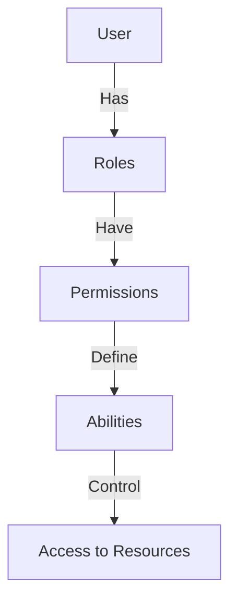

# CASL Authorization

The CASL module provides a robust, attribute-based access control system that integrates with NestJS controllers and services.

## Table of Contents

- [CASL Authorization](#casl-authorization)
  - [Table of Contents](#table-of-contents)
  - [Overview](#overview)
  - [Key Concepts](#key-concepts)
  - [Available Actions](#available-actions)
  - [Defining Permissions](#defining-permissions)
  - [Usage in Controllers](#usage-in-controllers)
  - [Dynamic Query Building](#dynamic-query-building)
  - [Checking Abilities](#checking-abilities)
  - [Role Management](#role-management)
  - [Best Practices](#best-practices)

## Overview

The authorization system uses CASL to define abilities based on roles and permissions. It integrates with PostgreSQL for storage and Redis for caching.



## Key Concepts

- **Subjects**: Entities that can be acted upon (User, Article, Role, Permission, etc.)
- **Actions**: Operations that can be performed (create, read, update, delete, etc.)
- **Permissions**: Define what actions can be performed on which subjects
- **Roles**: Collections of permissions assigned to users
- **Abilities**: Determined by a user's roles and their associated permissions

## Available Actions

The system defines these core actions:

| Action              | Description                            |
| ------------------- | -------------------------------------- |
| `super-modify`      | Full system access                     |
| `manage`            | Full access to a specific resource     |
| `create`            | Create new instances of a resource     |
| `read`              | View or list resources                 |
| `update`            | Modify existing resources              |
| `delete`            | Remove resources                       |
| `update-user-roles` | Special permission for assigning roles |

## Defining Permissions

Permissions are created through the API and stored in the database. Each permission defines:

- **Action**: What can be done (from the actions list above)
- **Subject**: What it can be done to (e.g., 'User', 'Article')
- **Fields** (optional): Specific fields that can be acted upon
- **Conditions** (optional): Additional checks (e.g., only own articles)
- **Inverted** (boolean): Whether this is an allow or deny rule

Example permission configuration:

```json
{
  "action": "read",
  "subject": "Article",
  "fields": ["title", "content", "createdAt"],
  "conditions": { "authorId": "${user.id}" },
  "inverted": false
}
```

This permission allows a user to read only their own articles, and only the specified fields.

## Usage in Controllers

Protect entire controllers or specific endpoints using the `@CheckPolicies()` decorator:

```typescript
@articleControllerDecorators()
export class ArticleController {
  constructor(private readonly articlesService: ArticleService) {}

  @articleCreateEndpointDecorators()
  create(@Body() createArticleDto: CreateArticleDto, @Request() req) {
    return this.articlesService.create(createArticleDto, req.user.id);
  }
}
```

Where the decorator is defined as:

```typescript
export function articleCreateEndpointDecorators() {
  return applyDecorators(
    Post(),
    ApiOperation({ summary: 'Create a new article' }),
    ApiResponse({
      status: 201,
      description: 'The article as been successfully created.',
      type: ResponseArticleDto,
    }),
    ApiBody({ type: CreateArticleDto }),
    CheckPolicies(
      (ability: AppAbility) =>
        ability.can('create', 'Article') ||
        ability.can('super-modify', 'Article'),
    ),
  );
}
```

## Dynamic Query Building

The system can automatically build TypeORM queries based on CASL abilities:

```typescript
async findAll(pagination: Pagination): Promise<PaginatedResponse<ResponseArticleDto>> {
  const { page, limit } = pagination;
  const ability = this.caslAbilityFactory.defineAbility(this.request.user);

  // This builds query conditions based on the user's abilities
  const permissionConditions = buildQueryforArticle(
    await ability,
    'read',
    this.request.user,
  );

  const [articles, count] = await this.articleRepository.findAndCount({
    where: {
      ...permissionConditions,
      // Additional conditions as needed
    },
    take: limit,
    skip: limit * (page - 1),
  });

  // Transform and return results
}
```

This ensures users can only access data they are authorized to see.

## Checking Abilities

You can directly check abilities in your service methods:

```typescript
async someOperation(entityId: string, user: User) {
  const entity = await this.repository.findOne(entityId);

  const ability = await this.caslAbilityFactory.defineAbility(user);

  if (ability.cannot('update', entity)) {
    throw new ForbiddenException('You are not authorized to update this entity');
  }

  // Proceed with the operation
}
```

## Role Management

Roles can be assigned through the API. Each user can have multiple roles, and each role can have multiple permissions.

Example role with permissions:

```json
{
  "name": "Editor",
  "permissions": [
    {
      "action": "read",
      "subject": "Article",
      "fields": ["*"]
    },
    {
      "action": "update",
      "subject": "Article",
      "conditions": { "authorId": "${user.id}" }
    },
    {
      "action": "create",
      "subject": "Article"
    }
  ]
}
```

## Best Practices

1. **Use Policy Decorators**: Create reusable decorators for common permission checks.

2. **Cache Abilities**: The system already caches abilities in Redis for performance.

3. **Layer Authorization**:

   - API layer: Use `@CheckPolicies()` decorators
   - Service layer: Use `ability.can()` checks
   - Query layer: Use `buildQueryFor<Entity>()` helpers

4. **Test Thoroughly**: Write unit tests for your policy checks.

5. **Keep Permissions Simple**:

   - Start with broader permissions and refine as needed
   - Use conditions to restrict access based on ownership
   - Be careful with inverted rules (deny rules) as they can create conflicts

6. **Default to Denial**: Always design the system to deny access by default.

7. **Admin Override**: Use `super-modify` action for admin users who need to bypass normal restrictions.

8. **Update Cache**: After role or permission changes, invalidate relevant cache entries.
