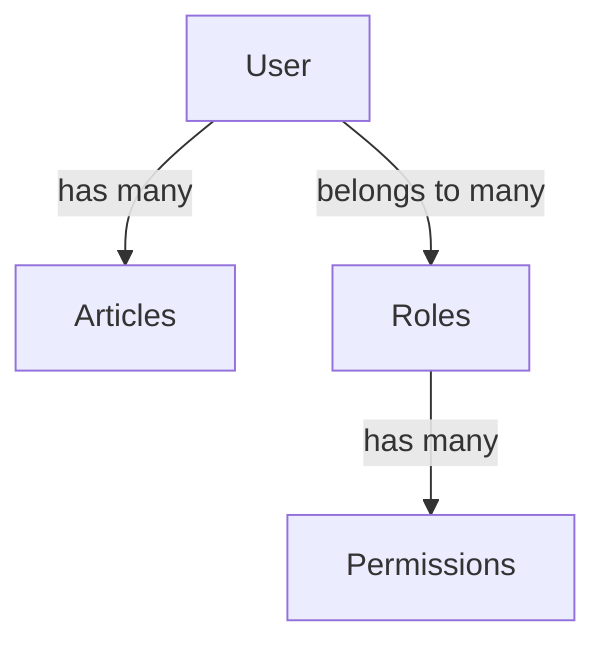
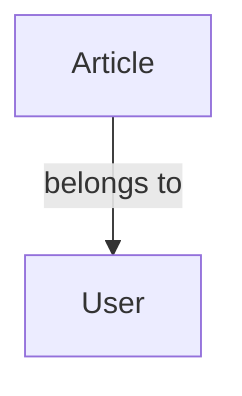
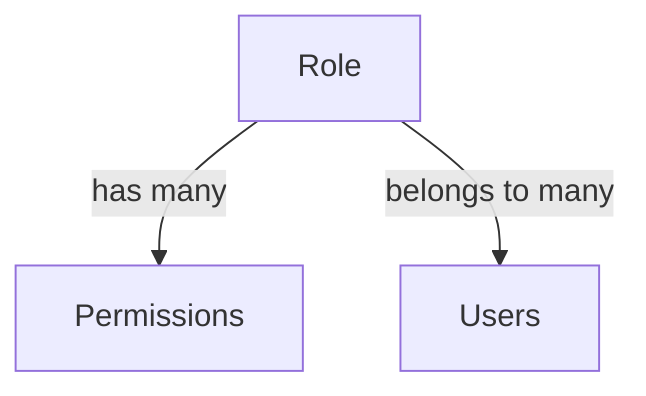

# Database Configuration

This document provides detailed information about the database configuration, migrations, entity relationships, and best practices used in the SalsetDatees API.

## Table of Contents

- [Database Configuration](#database-configuration)
  - [Table of Contents](#table-of-contents)
  - [Overview](#overview)
  - [Database Technologies](#database-technologies)
  - [Connection Configuration](#connection-configuration)
  - [Entity Structure](#entity-structure)
  - [Relationships](#relationships)
    - [User Relationships](#user-relationships)
    - [Article Relationships](#article-relationships)
    - [Role \& Permission Relationships](#role--permission-relationships)
  - [TypeORM Configuration](#typeorm-configuration)
  - [Migrations](#migrations)
    - [Creating Migrations](#creating-migrations)
    - [Running Migrations](#running-migrations)
    - [Reverting Migrations](#reverting-migrations)
  - [Seeders](#seeders)
  - [Caching Strategy](#caching-strategy)
  - [Redis Integration](#redis-integration)
  - [Database Transactions](#database-transactions)
  - [Best Practices](#best-practices)
  - [Performance Considerations](#performance-considerations)
  - [Development Environment Setup](#development-environment-setup)

## Overview

The SalsetDatees API uses a robust database architecture built on PostgreSQL with TypeORM as the ORM layer. The system is designed for:

- Type safety and strong typing
- Efficient querying with proper indexes
- Cache integration for performance optimization
- Well-defined relationships between entities
- Reliable migrations for schema evolution

## Database Technologies

The project uses the following database technologies:

| Technology | Purpose                   | Version |
| ---------- | ------------------------- | ------- |
| PostgreSQL | Primary database          | 15.x+   |
| TypeORM    | Object-Relational Mapping | 0.3.x   |
| Redis      | Caching layer             | 7.x+    |
| node-pg    | PostgreSQL driver         | 8.x+    |

## Connection Configuration

Database connection is configured through environment variables and TypeORM configuration:

```typescript
// TypeORM configuration in db.module.ts
export const DbModule = TypeOrmModule.forRootAsync({
  inject: [ConfigService],
  useFactory: (configService: ConfigService) => {
    const option = {
      type: 'postgres',
      host: configService.get<string>('POSTGRES_HOST'),
      port: +configService.get<string>('POSTGRES_PORT'),
      database: configService.get<string>('POSTGRES_DB'),
      username: configService.get<string>('POSTGRES_USER'),
      password: configService.get<string>('POSTGRES_PASSWORD'),
      synchronize: configService.get<boolean>('POSTGRES_SYNC', false),
      cache: {
        type: 'redis',
        options: {
          url:
            'redis://' +
            configService.get<string>('REDIS_HOST') +
            ':' +
            configService.get<number>('REDIS_PORT'),
        },
        duration: 300,
      },
      logging: false,
      autoLoadEntities: true,
      entities: ['dist/**/*.entity.{ts,js}'],
      migrations: ['dist/**/*.migration.{ts,js}'],
    } as TypeOrmModuleAsyncOptions;
    return option;
  },
});
```

Required environment variables:

| Variable          | Description                                    | Example      |
| ----------------- | ---------------------------------------------- | ------------ |
| POSTGRES_HOST     | Database host address                          | localhost    |
| POSTGRES_PORT     | Database port                                  | 5432         |
| POSTGRES_DB       | Database name                                  | salsetdatees |
| POSTGRES_USER     | Database username                              | postgres     |
| POSTGRES_PASSWORD | Database password                              | password     |
| POSTGRES_SYNC     | Auto schema synchronization (development only) | false        |
| REDIS_HOST        | Redis host for caching                         | localhost    |
| REDIS_PORT        | Redis port                                     | 6379         |

> **Warning**: Never set `POSTGRES_SYNC` to `true` in production, as it may cause data loss. Always use migrations for schema changes in production.

## Entity Structure

The application's data model consists of several core entities:

1. **User**: Represents system users
2. **Article**: Content created by users
3. **Role**: User role definitions
4. **Permission**: Fine-grained permissions
5. **Files**: File metadata (stored in MinIO)

## Relationships

### User Relationships



A User:

- Has many Articles (one-to-many)
- Belongs to many Roles (many-to-many)

### Article Relationships



An Article:

- Belongs to a single User (many-to-one)

### Role & Permission Relationships



A Role:

- Has many Permissions (many-to-many)
- Belongs to many Users (many-to-many)

## TypeORM Configuration

TypeORM is configured with the following settings:

- **Eager Loading**: Certain relationships like `user.roles` and `role.permissions` use eager loading
- **Cascading**: Cascading is enabled for certain relationships
- **Join Tables**: Many-to-many relationships use explicit join tables with custom names
- **Cache**: Query cache is enabled with Redis
- **Logging**: SQL logging is enabled in development but disabled in production

## Migrations

The project uses TypeORM migrations to manage database schema changes reliably.

### Creating Migrations

To create a new migration:

```bash
npm run migration:create -- -n CreateUsersTable
```

This will generate a timestamped migration file in the migrations directory.

Example migration file:

```typescript
import { MigrationInterface, QueryRunner, Table } from 'typeorm';

export class CreateUsersTable1614271200000 implements MigrationInterface {
  public async up(queryRunner: QueryRunner): Promise<void> {
    await queryRunner.createTable(
      new Table({
        name: 'users',
        columns: [
          {
            name: 'id',
            type: 'uuid',
            isPrimary: true,
            generationStrategy: 'uuid',
            default: 'uuid_generate_v4()',
          },
          {
            name: 'email',
            type: 'varchar',
            isUnique: true,
          },
          {
            name: 'password',
            type: 'varchar',
          },
          {
            name: 'firstName',
            type: 'varchar',
          },
          {
            name: 'lastName',
            type: 'varchar',
          },
          {
            name: 'isAdmin',
            type: 'boolean',
            default: false,
          },
          {
            name: 'createdAt',
            type: 'timestamp',
            default: 'now()',
          },
          {
            name: 'updatedAt',
            type: 'timestamp',
            default: 'now()',
          },
        ],
      }),
      true,
    );
  }

  public async down(queryRunner: QueryRunner): Promise<void> {
    await queryRunner.dropTable('users');
  }
}
```

### Running Migrations

To run all pending migrations:

```bash
npm run migration:run
```

This will apply all migrations that haven't been applied yet to the database.

### Reverting Migrations

To revert the last migration:

```bash
npm run migration:revert
```

This will undo the most recently applied migration.

## Seeders

The project includes database seeders to populate the database with initial data. Seeders are particularly useful for:

- Setting up initial admin users
- Creating default roles and permissions
- Populating test data in development

To run seeders:

```bash
npm run seed:run
```

Example seeder for creating an admin user:

```typescript
import { Seeder } from '@jorgebodega/typeorm-seeding';
import { DataSource } from 'typeorm';
import { User } from '../../users/entities/user.entity';
import { hashSync } from 'bcryptjs';

export default class CreateAdminUser implements Seeder {
  public async run(dataSource: DataSource): Promise<void> {
    const userRepository = dataSource.getRepository(User);

    // Check if admin already exists
    const existingAdmin = await userRepository.findOne({
      where: { email: 'admin@example.com' },
    });

    if (!existingAdmin) {
      const admin = userRepository.create({
        email: 'admin@example.com',
        password: hashSync('admin123', 10),
        firstName: 'Admin',
        lastName: 'User',
        isAdmin: true,
      });

      await userRepository.save(admin);
      console.log('Admin user created');
    }
  }
}
```

## Caching Strategy

The database module integrates with Redis for caching to improve performance:

1. **Query Cache**: Common queries are cached for 300ms by default
2. **Repository Methods**: Frequently used repository methods use `cache: true` option
3. **Custom Cache**: Complex queries use custom cache with the `@CACHE_MANAGER` injection

Example of using TypeORM's built-in cache:

```typescript
const user = await this.userRepository.findOne({
  where: { id },
  cache: 2000, // Cache for 2 seconds
});
```

## Redis Integration

Redis is used for:

1. TypeORM query cache
2. Custom data caching (abilities, permissions)
3. Refresh token storage
4. Rate limiting (when applicable)

Redis connection is configured through environment variables:

```
REDIS_HOST=localhost
REDIS_PORT=6379
```

The Redis module is configured in `app.module.ts`:

```typescript
CacheModule.registerAsync({
  isGlobal: true,
  useFactory: async () => ({
    store: await redisStore({
      socket: {
        host: process.env.REDIS_HOST,
        port: +process.env.REDIS_PORT,
      },
    }),
  }),
}),
```

## Database Transactions

For operations that need to be atomic, the application uses TypeORM transactions:

```typescript
async createUserWithRoles(userData: CreateUserDto, roleIds: number[]): Promise<User> {
  return await this.dataSource.transaction(async (manager) => {
    // Create the user
    const userRepo = manager.getRepository(User);
    const user = userRepo.create(userData);
    await userRepo.save(user);

    // Assign roles
    const roleRepo = manager.getRepository(Role);
    const roles = await roleRepo.findByIds(roleIds);
    user.roles = roles;

    // Save the user with roles
    return await userRepo.save(user);
  });
}
```

## Best Practices

1. **Always use migrations**: Never use `synchronize: true` in production
2. **Set up indexes**: Add indexes for frequently queried fields
3. **Use transactions**: For operations that modify multiple tables
4. **Cache wisely**: Don't over-cache; focus on high-impact queries
5. **Use eager loading sparingly**: It can lead to performance issues with large datasets
6. **Type everything**: Always define proper entity types and relationships
7. **Use repositories**: Access the database through TypeORM repositories
8. **Handle errors**: Properly catch and handle database errors
9. **Add constraints**: Use database constraints to ensure data integrity
10. **Validate input**: Validate all input before it reaches the database

## Performance Considerations

1. **Pagination**: Always paginate large result sets
2. **Select specific columns**: Use `select` to limit columns when appropriate
3. **Limit relations**: Load only necessary relations
4. **Use query builder**: For complex queries, use the query builder
5. **Index properly**: Add indexes for commonly queried fields
6. **Monitor query performance**: Use TypeORM logging to identify slow queries
7. **Use caching strategically**: Cache frequently accessed, rarely changed data

## Development Environment Setup

Setting up the database for development:

1. Install PostgreSQL and Redis:

   ```bash
   # For Ubuntu/Debian
   sudo apt update
   sudo apt install postgresql postgresql-contrib redis-server

   # For macOS with Homebrew
   brew install postgresql redis
   ```

2. Create a database:

   ```bash
   sudo -u postgres psql
   postgres=# CREATE DATABASE salsetdatees;
   postgres=# CREATE USER myuser WITH ENCRYPTED PASSWORD 'mypass';
   postgres=# GRANT ALL PRIVILEGES ON DATABASE salsetdatees TO myuser;
   postgres=# \q
   ```

3. Set up environment variables in `.env` file:

   ```
   POSTGRES_HOST=localhost
   POSTGRES_PORT=5432
   POSTGRES_DB=salsetdatees
   POSTGRES_USER=myuser
   POSTGRES_PASSWORD=mypass
   POSTGRES_SYNC=false
   REDIS_HOST=localhost
   REDIS_PORT=6379
   ```

4. Run migrations and seeders:

   ```bash
   npm run migration:run
   npm run seed:run
   ```

5. Start the API:

   ```bash
   npm run start:dev
   ```
