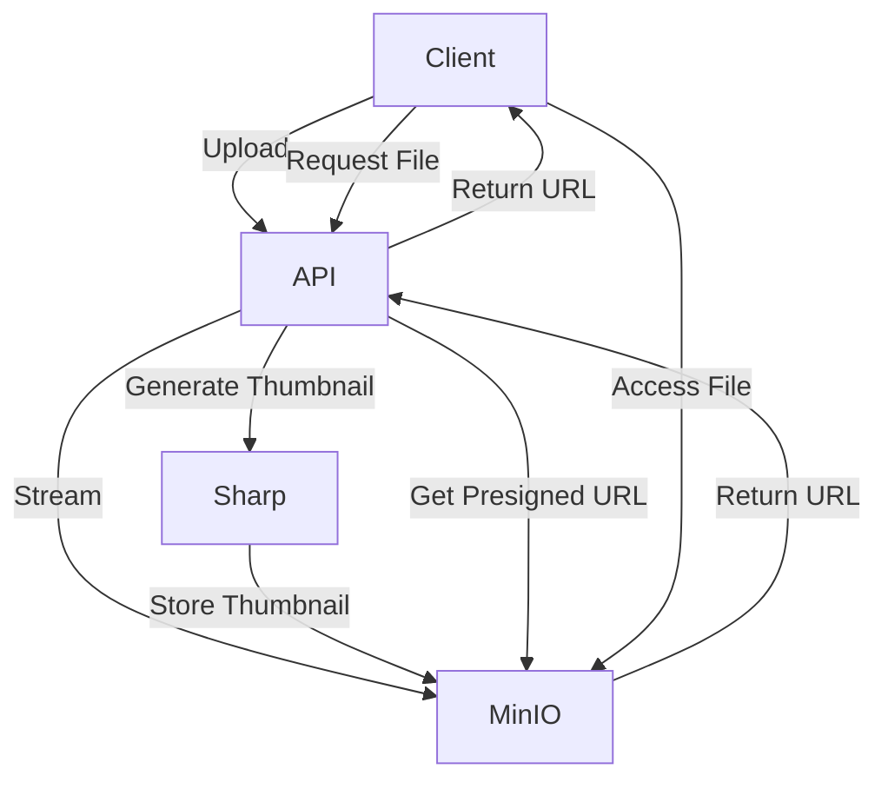

# File System Module

The File System module provides comprehensive file handling capabilities using MinIO as the storage backend.

## Table of Contents

- [File System Module](#file-system-module)
  - [Table of Contents](#table-of-contents)
  - [Overview](#overview)
  - [Configuration](#configuration)
  - [API Endpoints](#api-endpoints)
    - [Upload Files](#upload-files)
    - [Download File](#download-file)
    - [Batch Download URLs](#batch-download-urls)
    - [File Metadata](#file-metadata)
    - [List Files](#list-files)
    - [Delete File](#delete-file)
    - [List Buckets](#list-buckets)
    - [Create Bucket](#create-bucket)
    - [Delete Bucket](#delete-bucket)
  - [File Operations](#file-operations)
    - [Uploading Files](#uploading-files)
    - [Downloading Files](#downloading-files)
  - [Thumbnail Generation](#thumbnail-generation)
  - [Security and Authorization](#security-and-authorization)
  - [Integration Guide](#integration-guide)
    - [Frontend Integration](#frontend-integration)
    - [Displaying Files](#displaying-files)
  - [Performance Considerations](#performance-considerations)
  - [Resource Usage](#resource-usage)
  - [Troubleshooting](#troubleshooting)
    - [Common Issues](#common-issues)
    - [Debug Logging](#debug-logging)

## Overview

The File System module uses MinIO as an S3-compatible storage service to:

- Upload files with streaming to minimize memory usage
- Generate thumbnails for images
- Provide presigned URLs for secure file access
- Manage buckets for file organization
- Handle file metadata and retrieval



## Configuration

The module is configured through environment variables:

| Variable                           | Description              | Default                | Example                   |
| ---------------------------------- | ------------------------ | ---------------------- | ------------------------- |
| `MINIO_ENDPOINT`                   | MinIO server hostname    | -                      | `minio`                   |
| `MINIO_PORT`                       | MinIO server port        | `9000`                 | `9000`                    |
| `MINIO_USE_SSL`                    | Whether to use SSL       | `false`                | `true`                    |
| `MINIO_ROOT_USER`                  | MinIO username           | -                      | `minioadmin`              |
| `MINIO_ROOT_PASSWORD`              | MinIO password           | -                      | `minioadmin`              |
| `MINIO_REGION`                     | Default region           | `us-east-1`            | `us-east-1`               |
| `MINIO_MAX_FILE_SIZE_MB`           | Maximum file size        | `100`                  | `500`                     |
| `MINIO_THUMBNAIL_SIZE`             | Thumbnail dimensions     | `300`                  | `200`                     |
| `MINIO_THUMBNAIL_PREFIX`           | Prefix for thumbnails    | `thumb_`               | `thumbnail-`              |
| `MINIO_PRESIGNED_URL_EXPIRY`       | URL expiry in seconds    | `86400`                | `3600`                    |
| `MINIO_ALLOWED_MIME_TYPES`         | Comma-separated list     | -                      | `image/*,application/pdf` |
| `MINIO_DIRECT_DOWNLOAD_MIME_TYPES` | Types to stream directly | `image/,video/,audio/` | `image/,video/`           |

## API Endpoints

### Upload Files

```
POST /api/files/upload/:bucket
```

**Request:**

- Content-Type: `multipart/form-data`
- Body: Form data with one or more files

**Response:**

```json
{
  "success": true,
  "statusCode": 200,
  "message": ["Files uploaded successfully"],
  "data": {
    "files": [
      {
        "originalName": "example.jpg",
        "uniqueName": "example-20240423142536-a1b2c3d4.jpg",
        "size": 12345,
        "mimetype": "image/jpeg",
        "thumbnailName": "thumb_example-20240423142536-a1b2c3d4.jpg",
        "url": "https://...",
        "thumbnailUrl": "https://...",
        "bucket": "default",
        "uploadedAt": "2024-04-23T14:25:36.789Z"
      }
    ]
  }
}
```

**Validation Errors:**

```json
{
  "success": false,
  "statusCode": 400,
  "message": ["Please enter valid data"],
  "validationErrors": {
    "mimetype": ["File type application/zip is not allowed"]
  }
}
```

### Download File

```
GET /api/files/download/:bucket/:filename
```

**Parameters:**

- `direct` (query): Set to "true" to stream the file directly (optional)

**Response:**

- If `direct=true`: File is streamed directly with appropriate headers
- Otherwise: JSON with presigned URL

```json
{
  "success": true,
  "statusCode": 200,
  "message": ["Download URL generated successfully"],
  "data": {
    "url": "https://..."
  }
}
```

### Batch Download URLs

```
GET /api/files/batch-download?bucket=:bucket&filenames=:filenames
```

**Parameters:**

- `bucket` (query): The bucket name
- `filenames` (query): Comma-separated list of filenames
- `expiry` (query): Expiry time in seconds (optional)

**Response:**

```json
{
  "success": true,
  "statusCode": 200,
  "message": ["Download URLs generated successfully"],
  "data": {
    "urls": {
      "file1.jpg": "https://...",
      "file2.pdf": "https://..."
    }
  }
}
```

### File Metadata

```
GET /api/files/metadata/:bucket/:filename
```

**Response:**

```json
{
  "success": true,
  "statusCode": 200,
  "message": ["File metadata retrieved successfully"],
  "data": {
    "metadata": {
      "originalName": "example.jpg",
      "uniqueName": "example-20240423142536-a1b2c3d4.jpg",
      "size": 12345,
      "mimetype": "image/jpeg",
      "thumbnailName": "thumb_example-20240423142536-a1b2c3d4.jpg",
      "url": "https://...",
      "thumbnailUrl": "https://...",
      "bucket": "default",
      "uploadedAt": "2024-04-23T14:25:36.789Z"
    }
  }
}
```

### List Files

```
GET /api/files/list/:bucket
```

**Parameters:**

- `prefix` (query): Filter files by prefix (optional)
- `recursive` (query): Whether to list files recursively (optional)

**Response:**

```json
{
  "success": true,
  "statusCode": 200,
  "message": ["Files listed successfully"],
  "data": {
    "files": [
      {
        "originalName": "example1.jpg",
        "uniqueName": "example1-20240423142536-a1b2c3d4.jpg",
        "size": 12345,
        "mimetype": "image/jpeg",
        "thumbnailName": "thumb_example1-20240423142536-a1b2c3d4.jpg",
        "url": "https://...",
        "thumbnailUrl": "https://...",
        "bucket": "default",
        "uploadedAt": "2024-04-23T14:25:36.789Z"
      }
    ]
  }
}
```

### Delete File

```
DELETE /api/files/delete/:bucket/:filename
```

**Response:**

```json
{
  "success": true,
  "statusCode": 200,
  "message": ["File deleted successfully"]
}
```

### List Buckets

```
GET /api/files/buckets
```

**Response:**

```json
{
  "success": true,
  "statusCode": 200,
  "message": ["Buckets listed successfully"],
  "data": {
    "buckets": [
      {
        "name": "default",
        "creationDate": "2024-04-23T14:25:36.789Z"
      }
    ]
  }
}
```

### Create Bucket

```
POST /api/files/buckets/:name
```

**Parameters:**

- `region` (query): Region for the bucket (optional)
- `publicPolicy` (query): Whether to set a public policy (optional)

**Response:**

```json
{
  "success": true,
  "statusCode": 201,
  "message": ["Bucket created successfully"]
}
```

### Delete Bucket

```
DELETE /api/files/buckets/:name
```

**Parameters:**

- `force` (query): Whether to force deletion by removing all objects (optional)

**Response:**

```json
{
  "success": true,
  "statusCode": 200,
  "message": ["Bucket deleted successfully"]
}
```

## File Operations

### Uploading Files

The upload process uses streaming to efficiently handle files of any size (up to the configured limit):

1. Client sends multipart request with files
2. Each file is streamed directly to MinIO
3. For images, thumbnails are generated
4. File metadata is returned to the client

### Downloading Files

Two download methods are supported:

1. **Direct streaming**: For media files (images, videos, audio)

   - The file is streamed directly from MinIO to the client
   - No intermediary storage is used

2. **Presigned URLs**: For documents and other files
   - A time-limited secure URL is generated
   - The client can use this URL to download directly from MinIO

## Thumbnail Generation

Thumbnails are automatically generated for image files using Sharp:

- Only images receive thumbnails (not PDFs or other files)
- Thumbnails are resized to the configured dimensions while maintaining aspect ratio
- Thumbnails are stored with the `thumb_` prefix in the same bucket
- Thumbnail URLs are included in the file metadata response

## Security and Authorization

The file system integrates with the CASL authorization system:

| Permission                | Description                        |
| ------------------------- | ---------------------------------- |
| `create` on `Files`       | Upload files                       |
| `read` on `Files`         | Download and view files            |
| `delete` on `Files`       | Delete files                       |
| `super-modify` on `Files` | Full access to all file operations |

Example policy checker for file upload:

```typescript
@filesUploadEndpointDecorators()
async uploadFiles() {
  // ...
}

// Where the decorator is defined as:
export function filesUploadEndpointDecorators() {
  return applyDecorators(
    Post('upload/:bucket'),
    // ...
    CheckPolicies(
      (ability: AppAbility) =>
        ability.can('create', 'Files') || ability.can('super-modify', 'Files'),
    ),
  );
}
```

## Integration Guide

### Frontend Integration

1. Use a standard form with multipart/form-data for uploads:

```html
<form enctype="multipart/form-data">
  <input type="file" name="file" multiple />
  <button type="submit">Upload</button>
</form>
```

2. Handle the form with fetch:

```javascript
const form = document.querySelector('form');
form.addEventListener('submit', async (e) => {
  e.preventDefault();
  const formData = new FormData(form);

  try {
    const response = await fetch('/api/files/upload/default', {
      method: 'POST',
      body: formData,
    });

    const result = await response.json();
    // Handle result
  } catch (error) {
    // Handle error
  }
});
```

### Displaying Files

Use the URLs returned in the response to display files or thumbnails:

```javascript
function displayFile(file) {
  if (file.mimetype.startsWith('image/')) {
    // Use thumbnail for images
    return ``;
  } else {
    // Use appropriate icon for other file types
    return `<a href="${file.url}">${file.originalName}</a>`;
  }
}
```

## Performance Considerations

The file system is designed for efficiency and low resource usage:

1. **Streaming Upload**: Files are streamed directly to MinIO without loading entirely into memory
2. **Throttled Operations**: Concurrent operations are limited to prevent overloading
3. **Efficient Listings**: File listings use pagination and streaming
4. **Resource Cleanup**: Temporary files are properly cleaned up

## Resource Usage

To keep resource usage low, the file system:

1. Uses Node.js streams for all file operations
2. Implements proper backpressure handling
3. Processes files one at a time during uploads
4. Uses batching for operations like bucket cleanup
5. Implements concurrency limits for metadata operations
6. Cleans up resources even when errors occur

## Troubleshooting

### Common Issues

1. **Upload hangs or times out**

   - Check file size against `MINIO_MAX_FILE_SIZE_MB` limit
   - Verify allowed MIME types in configuration
   - Check MinIO server connectivity

2. **File not found on download**

   - Verify the bucket and filename are correct
   - Check if the file was properly uploaded
   - Ensure the bucket policy allows access

3. **Thumbnail not generated**

   - Only image files get thumbnails
   - Check Sharp library installation
   - Verify temporary directory permissions

4. **Permission denied**
   - Check user roles and permissions
   - Verify CASL authorization rules
   - Check MinIO access credentials

### Debug Logging

The file system uses a logger that can be helpful for troubleshooting:

```
api | Processing file: example.jpg, mimetype: image/jpeg
api | Successfully uploaded: example.jpg
```

Enable more verbose logging by setting the appropriate log level in your environment configuration.
