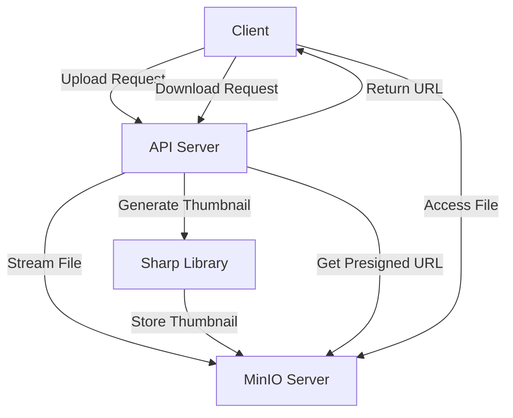

# MinIO Configuration and Integration

This document details the MinIO integration used in the SalsetDatees API for object storage, covering configuration, service implementation, and best practices.

## Table of Contents

- [MinIO Configuration and Integration](#minio-configuration-and-integration)
  - [Table of Contents](#table-of-contents)
  - [Overview](#overview)
  - [Architecture](#architecture)
  - [MinIO Server Setup](#minio-server-setup)
    - [Docker Setup](#docker-setup)
    - [Standalone Setup](#standalone-setup)
  - [Environment Configuration](#environment-configuration)
  - [Connection Configuration](#connection-configuration)
  - [Service Implementation](#service-implementation)
    - [MinioConfigService](#minioconfigservice)
    - [MinioFilesService](#miniofilesservice)
    - [Key Service Methods](#key-service-methods)
  - [API Integration](#api-integration)
  - [Security Considerations](#security-considerations)
  - [File Organization](#file-organization)
    - [Buckets Strategy](#buckets-strategy)
    - [Object Naming](#object-naming)
  - [Performance Optimization](#performance-optimization)
  - [Thumbnail Generation](#thumbnail-generation)
  - [Direct vs. Presigned URLs](#direct-vs-presigned-urls)
  - [Error Handling](#error-handling)
  - [Monitoring and Logging](#monitoring-and-logging)
  - [Deployment Considerations](#deployment-considerations)
  - [Testing](#testing)
  - [Troubleshooting](#troubleshooting)
  - [Maintenance](#maintenance)

## Overview

MinIO is used in the SalsetDatees API as a high-performance, S3-compatible object storage solution. It handles file storage needs including:

- User uploads (images, documents, videos)
- Thumbnail generation and storage
- Secure access control via presigned URLs
- Bucket management for file organization

This integration allows for scalable, efficient file storage while maintaining complete control over the storage infrastructure.

## Architecture

The MinIO integration follows this architecture:



Key components:

- **MinioConfigService**: Manages connection to MinIO server
- **MinioFilesService**: Handles file operations (upload, download, etc.)
- **MinioFilesController**: Exposes REST endpoints for file operations
- **Sharp Library**: Processes images and generates thumbnails

## MinIO Server Setup

### Docker Setup

The recommended way to run MinIO in development is using Docker:

```yaml
# docker-compose.yml
version: '3'
services:
  minio:
    image: minio/minio
    ports:
      - '9000:9000'
      - '9001:9001'
    environment:
      MINIO_ROOT_USER: minioadmin
      MINIO_ROOT_PASSWORD: minioadmin
    volumes:
      - minio_data:/data
    command: server --console-address ":9001" /data

volumes:
  minio_data:
```

Start with:

```bash
docker-compose up -d
```

The MinIO server will be available at:

- API: http://localhost:9000
- Console: http://localhost:9001

### Standalone Setup

For standalone installation:

1. Download MinIO from [https://min.io/download](https://min.io/download)
2. Install and run:

```bash
# Linux/macOS
wget https://dl.min.io/server/minio/release/linux-amd64/minio
chmod +x minio
./minio server /data --console-address ":9001"

# Windows (PowerShell)
Invoke-WebRequest -Uri "https://dl.min.io/server/minio/release/windows-amd64/minio.exe" -OutFile "minio.exe"
.\minio.exe server D:\data --console-address ":9001"
```

## Environment Configuration

The MinIO integration uses these environment variables:

| Variable                           | Description                | Default                | Example                   |
| ---------------------------------- | -------------------------- | ---------------------- | ------------------------- |
| `MINIO_ENDPOINT`                   | MinIO server hostname      | -                      | `minio` or `localhost`    |
| `MINIO_PORT`                       | MinIO server port          | `9000`                 | `9000`                    |
| `MINIO_USE_SSL`                    | Whether to use SSL         | `false`                | `true`                    |
| `MINIO_ROOT_USER`                  | MinIO admin username       | -                      | `minioadmin`              |
| `MINIO_ROOT_PASSWORD`              | MinIO admin password       | -                      | `minioadmin`              |
| `MINIO_REGION`                     | Default region             | `us-east-1`            | `us-east-1`               |
| `MINIO_MAX_FILE_SIZE_MB`           | Maximum file size          | `100`                  | `500`                     |
| `MINIO_THUMBNAIL_SIZE`             | Thumbnail size in pixels   | `300`                  | `200`                     |
| `MINIO_THUMBNAIL_PREFIX`           | Prefix for thumbnails      | `thumb_`               | `thumbnail-`              |
| `MINIO_PRESIGNED_URL_EXPIRY`       | URL expiry time in seconds | `86400`                | `3600`                    |
| `MINIO_ALLOWED_MIME_TYPES`         | Allowed file types         | -                      | `image/*,application/pdf` |
| `MINIO_DIRECT_DOWNLOAD_MIME_TYPES` | Types to stream directly   | `image/,video/,audio/` | `image/,video/`           |

## Connection Configuration

The MinIO connection is configured through the `MinioConfigService`:

```typescript
@Injectable()
export class MinioConfigService implements OnModuleInit {
  private minioClient: Client;
  private readonly logger = new Logger(MinioConfigService.name);

  constructor(private configService: ConfigService) {
    const endpoint = this.configService.get<string>('MINIO_ENDPOINT');
    const port = +this.configService.get<string>('MINIO_PORT');
    const useSSL = this.configService.get<string>('MINIO_USE_SSL') === 'true';
    const accessKey = this.configService.get<string>('MINIO_ROOT_USER');
    const secretKey = this.configService.get<string>('MINIO_ROOT_PASSWORD');
    const region = this.configService.get<string>('MINIO_REGION', 'us-east-1');

    if (!endpoint || !accessKey || !secretKey) {
      this.logger.error(
        'Missing required MinIO configuration. Please check your environment variables.',
      );
      throw new Error('Missing required MinIO configuration');
    }

    this.logger.log(
      `Initializing MinIO client for endpoint: ${endpoint}:${port}, SSL: ${useSSL}`,
    );

    this.minioClient = new Client({
      endPoint: endpoint,
      port: port,
      useSSL: useSSL,
      accessKey: accessKey,
      secretKey: secretKey,
      region: region,
      partSize: 64 * 1024 * 1024, // 64MB parts for multipart uploads
    });
  }

  async onModuleInit() {
    try {
      await this.checkConnection();
    } catch (error) {
      this.logger.error(
        'Failed to connect to MinIO server during initialization',
        error,
      );
    }
  }

  getClient(): Client {
    return this.minioClient;
  }

  async checkConnection(): Promise<boolean> {
    try {
      await this.minioClient.listBuckets();
      this.logger.log('Successfully connected to MinIO server');
      return true;
    } catch (error) {
      this.logger.error(
        `Failed to connect to MinIO server: ${error.message}`,
        error.stack,
      );
      return false;
    }
  }
}
```

## Service Implementation

### MinioConfigService

This service handles connection to the MinIO server and provides:

- Client initialization with proper configuration
- Connection checking and validation
- Error handling for connection issues
- Logging for debugging and monitoring

### MinioFilesService

This service implements the core file operations:

- File uploading with streaming
- File downloading with presigned URLs or direct streaming
- Thumbnail generation for images
- Bucket management (creation, listing, deletion)
- File metadata management

### Key Service Methods

Important methods in the MinioFilesService include:

**File Upload**:

```typescript
async uploadFile(
  bucket: string,
  filename: string,
  fileStream: BusboyFileStream,
  mimetype: string,
): Promise<FileMetadata> {
  // Validation and bucket existence check
  // Streaming upload to MinIO
  // Thumbnail generation for images
  // Return file metadata with URLs
}
```

**Presigned URL Generation**:

```typescript
async generatePresignedUrl(
  bucket: string,
  objectName: string,
  expirySeconds?: number,
): Promise<string> {
  try {
    return await this.minioClient.presignedGetObject(
      bucket,
      objectName,
      expirySeconds || this.config.presignedUrlExpiry,
    );
  } catch (error) {
    this.logger.error(
      `Error generating presigned URL for ${objectName}: ${error.message}`,
      error.stack,
    );
    throw error;
  }
}
```

**Thumbnail Generation**:

```typescript
private async generateThumbnail(
  bucket: string,
  objectName: string,
  filePath: string,
  mimetype: string,
): Promise<string | null> {
  // Only for images
  // Resize with Sharp
  // Upload thumbnail to MinIO
  // Return thumbnail name
}
```

## API Integration

The MinIO integration is exposed via the REST API through `MinioFilesController`:

```typescript
@filesControllerDecorators()
export class MinioFilesController {
  constructor(private readonly minioService: MinioFilesService) {}

  @filesUploadEndpointDecorators()
  async uploadFiles(
    @Param('bucket') bucket: string,
    @Req() req: FastifyRequest,
  ): Promise<UploadFileResponseDto> {
    // Process file upload
  }

  @filesDownloadEndpointDecorators()
  async downloadFile(
    @Param('bucket') bucket: string,
    @Param('filename') filename: string,
    @Query('direct') direct?: string,
    @Res() response?: FastifyReply,
  ): Promise<DownloadUrlResponseDto | void> {
    // Process file download
  }

  // Other endpoints...
}
```

## Security Considerations

The MinIO implementation includes several security features:

1. **Bucket Policies**: Public or private access control at the bucket level
2. **Presigned URLs**: Time-limited access to files with expiration
3. **MIME Type Validation**: Restrict uploads to specific file types
4. **Size Limits**: Prevent large file attacks
5. **Streaming**: Efficient memory usage to prevent DOS attacks
6. **Error Handling**: Secure error messages that don't leak information
7. **Permission Checks**: Integration with CASL for access control

Example bucket policy:

```typescript
const policy = {
  Version: '2012-10-17',
  Statement: [
    {
      Action: ['s3:GetObject'],
      Effect: 'Allow',
      Principal: { AWS: ['*'] },
      Resource: [`arn:aws:s3:::${bucketName}/*`],
      Sid: 'PublicRead',
    },
  ],
};
```

## File Organization

### Buckets Strategy

Files are organized into buckets based on their purpose or access patterns:

| Bucket          | Purpose          | Access Pattern                   |
| --------------- | ---------------- | -------------------------------- |
| `default`       | General purpose  | Public read, authenticated write |
| `user-profiles` | Profile pictures | Public read, authenticated write |
| `documents`     | Document files   | Private, authenticated access    |
| `media`         | Media files      | Public read, authenticated write |

### Object Naming

File names are structured for uniqueness and organization:

```
originalname-timestamp-randomstring.ext
```

Example: `document-20230423142536-a1b2c3d4.pdf`

Thumbnails follow the pattern:

```
thumb_originalname-timestamp-randomstring.ext
```

Example: `thumb_image-20230423142536-a1b2c3d4.jpg`

## Performance Optimization

The MinIO integration includes several performance optimizations:

1. **Streaming Uploads**: Files are streamed directly to MinIO without loading entirely into memory
2. **Temporary Files**: Large files use temporary storage before upload to ensure data integrity
3. **Batched Operations**: Operations like listing use pagination to prevent memory issues
4. **Concurrent Request Limit**: Limit concurrent operations to prevent overwhelming the server
5. **Cleanup Routines**: Temporary files are properly cleaned up even on errors

Example of streaming optimization:

```typescript
// Use fPutObject for reliable uploads of complete files
await this.minioClient.fPutObject(bucket, uniqueName, tempFilePath, metadata);
```

## Thumbnail Generation

Thumbnails are generated for image files only, using the Sharp library:

1. Image is saved to a temporary file
2. Sharp processes the image to create a thumbnail
3. Thumbnail is uploaded to MinIO with the same name pattern but a prefix
4. Temporary files are cleaned up
5. Thumbnail URL is included in the file metadata response

Example thumbnail generation:

```typescript
await sharp(filePath)
  .resize(this.config.thumbnailSize, this.config.thumbnailSize, {
    fit: 'inside',
    withoutEnlargement: true,
  })
  .toFile(thumbnailPath);
```

## Direct vs. Presigned URLs

The system supports two download methods:

1. **Direct Streaming**: For media files that should be viewed directly (images, videos, audio)

   - Files are streamed from MinIO through the API to the client
   - Better for immediate viewing in browsers

2. **Presigned URLs**: For documents and other files
   - A time-limited URL is generated for direct access to MinIO
   - Better for downloads and large files
   - Reduces server load as the download happens directly from MinIO

The selection is made based on:

- MIME type configuration
- Client request preferences
- File size considerations

## Error Handling

The MinIO integration implements comprehensive error handling:

1. **Validation Errors**: Caught early and returned with descriptive messages
2. **Connection Errors**: Handled gracefully with retries and detailed logging
3. **Not Found Errors**: Specific error responses for missing buckets or files
4. **Permission Errors**: Proper error messages for permission issues
5. **Size Limit Errors**: Clear messages about file size limitations
6. **Cleanup**: Resources are properly released even during errors

Example error handling:

```typescript
try {
  // Attempt to upload file
} catch (error) {
  this.logger.error(`Error uploading file: ${error.message}`, error.stack);

  // Clean up partial upload
  try {
    await this.minioClient.removeObject(bucket, uniqueName);
  } catch (cleanupError) {
    this.logger.warn(
      `Failed to clean up partial upload: ${cleanupError.message}`,
    );
  }

  // Rethrow with appropriate status
  if (error instanceof BadRequestException) {
    throw error;
  } else {
    throw new InternalServerErrorException(
      `Failed to upload file: ${error.message}`,
    );
  }
}
```

## Monitoring and Logging

The MinIO integration includes comprehensive logging for operations and errors:

1. **Initialization Logging**: Log connection status and configuration
2. **Operation Logging**: Log major operations like uploads and downloads
3. **Error Logging**: Detailed error logs with stack traces for debugging
4. **Warning Logging**: Logs for non-fatal issues
5. **Performance Logging**: Optional timing logs for performance monitoring
6. **Cleanup Logging**: Logs for cleanup operations

Example logging:

```typescript
this.logger.log(`Processing file: ${filename}, mimetype: ${mimetype}`);
this.logger.log(`Successfully uploaded: ${filename}`);
this.logger.error(`Error processing file ${filename}: ${error.message}`);
```

## Deployment Considerations

When deploying the MinIO integration:

1. **Resource Requirements**:

   - MinIO server needs sufficient disk space
   - Consider SSD for performance on high-traffic systems
   - Memory requirements depend on concurrent connections

2. **Networking**:

   - Ensure API server can reach MinIO server
   - Configure proper firewall rules
   - Consider using internal network for better security

3. **Security**:

   - Use SSL in production
   - Use strong credentials
   - Consider network isolation

4. **Scaling**:

   - MinIO supports distributed deployment for scaling
   - Consider load balancing for high-traffic scenarios

5. **Backups**:
   - Implement regular backups of MinIO data
   - Consider replication for critical data

## Testing

Testing the MinIO integration:

1. **Unit Tests**:

   - Mock MinIO client for service method testing
   - Test error handling and edge cases

2. **Integration Tests**:

   - Use MinIO Docker container for testing
   - Test complete upload/download flow

3. **Performance Tests**:
   - Test with various file sizes
   - Measure response times and memory usage
   - Test concurrent uploads and downloads

Example test setup with Jest:

```typescript
describe('MinioFilesService', () => {
  let service: MinioFilesService;
  let minioClientMock;

  beforeEach(async () => {
    minioClientMock = {
      putObject: jest.fn().mockResolvedValue({}),
      getObject: jest.fn().mockResolvedValue(createReadStream('test-file.txt')),
      presignedGetObject: jest.fn().mockResolvedValue('https://test-url.com'),
      statObject: jest.fn().mockResolvedValue({
        metaData: { 'Content-Type': 'text/plain' },
        size: 1024,
      }),
    };

    const module: TestingModule = await Test.createTestingModule({
      providers: [
        MinioFilesService,
        {
          provide: MinioConfigService,
          useValue: {
            getClient: () => minioClientMock,
          },
        },
        {
          provide: ConfigService,
          useValue: {
            get: jest.fn((key) => {
              const config = {
                MINIO_MAX_FILE_SIZE_MB: 100,
                MINIO_THUMBNAIL_SIZE: 300,
              };
              return config[key];
            }),
          },
        },
      ],
    }).compile();

    service = module.get<MinioFilesService>(MinioFilesService);
  });

  it('should generate a presigned URL', async () => {
    const url = await service.generatePresignedUrl(
      'test-bucket',
      'test-file.txt',
    );
    expect(url).toBe('https://test-url.com');
    expect(minioClientMock.presignedGetObject).toHaveBeenCalledWith(
      'test-bucket',
      'test-file.txt',
      expect.any(Number),
    );
  });
});
```

## Troubleshooting

Common issues and solutions:

1. **Connection Failed**

   - Check that MinIO server is running
   - Verify credentials in environment variables
   - Ensure network connectivity between API and MinIO

2. **Upload Failed**

   - Check file size limits
   - Verify MIME type restrictions
   - Check disk space on MinIO server
   - Inspect detailed error logs

3. **Download Issues**

   - Verify file exists in the specified bucket
   - Check bucket policies
   - Verify URL expiry settings

4. **Thumbnail Generation Failed**

   - Check Sharp library installation
   - Ensure file is a valid image
   - Verify temporary directory permissions

5. **Performance Issues**
   - Monitor MinIO server resource usage
   - Check network latency
   - Consider increasing part size for large files
   - Implement appropriate caching strategies

## Maintenance

Regular maintenance tasks:

1. **Cleanup**:

   - Implement routine to clean up orphaned files
   - Remove expired temporary files

2. **Monitoring**:

   - Monitor disk space usage
   - Track error rates and performance metrics
   - Set up alerts for critical issues

3. **Backup**:

   - Regular backup of MinIO data
   - Periodic backup verification

4. **Updates**:
   - Keep MinIO server up to date
   - Update client libraries
   - Apply security patches
