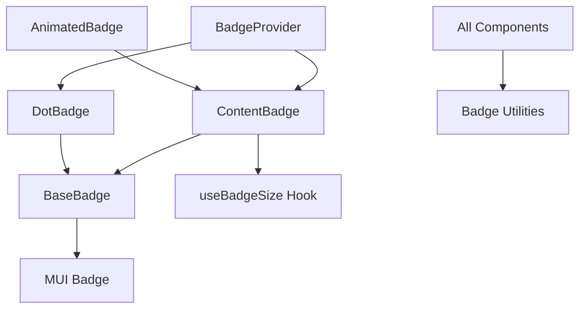

# Badge Module


A flexible, customizable, and performance-optimized badge component system for React applications. This module integrates Material UI's Badge component with Tailwind CSS for styling, providing an elegant solution for notification indicators, counters, and status badges.

## Table of Contents

- [Badge Module](#badge-module)
  - [Table of Contents](#table-of-contents)
  - [Installation](#installation)
  - [Architecture](#architecture)
    - [Key Design Principles](#key-design-principles)
  - [Components](#components)
    - [BadgeProvider](#badgeprovider)
    - [BaseBadge](#basebadge)
    - [ContentBadge](#contentbadge)
    - [DotBadge](#dotbadge)
    - [AnimatedBadge](#animatedbadge)
  - [Hooks](#hooks)
    - [useBadgeSize](#usebadgesize)
  - [Utilities](#utilities)
  - [Usage Examples](#usage-examples)
    - [Simple Usage](#simple-usage)
    - [Advanced Usage](#advanced-usage)
    - [Animation Examples](#animation-examples)
  - [API Reference](#api-reference)
    - [BadgeOptions](#badgeoptions)
    - [Component Props](#component-props)
      - [BadgeProviderProps](#badgeproviderprops)
      - [ContentBadgeProps](#contentbadgeprops)
      - [DotBadgeProps](#dotbadgeprops)
  - [Performance Considerations](#performance-considerations)
    - [Performance Comparison](#performance-comparison)
  - [Best Practices](#best-practices)
  - [Browser Compatibility](#browser-compatibility)
  - [Contributing](#contributing)
  - [License](#license)

## Installation

Ensure you have the required dependencies:

```bash
npm install @mui/material react-icons
```

Then copy the badge module files to your project:

```
/src
  /components
    /badge
      # Copy all files here
```

## Architecture

The Badge Module follows SOLID principles and a component-based architecture:



### Key Design Principles

- **Single Responsibility**: Each component has a focused purpose
- **Composition**: Components are built through composition rather than inheritance
- **Customization**: Every aspect is customizable through a unified options API
- **Performance**: Optimized rendering and DOM manipulation
- **Developer Experience**: Easy-to-use API with sensible defaults

## Components

### BadgeProvider

The main entry point component that simplifies badge usage by automatically choosing the appropriate badge type.

```tsx
<BadgeProvider 
  content={5} 
  Icon={BsMailbox} 
  options={{
    colorTypeBadge: 'bg-blue-500 text-white',
  }}
/>
```

**Decision Tree**:

| Condition | Badge Type |
|-----------|------------|
| `content` is undefined | DotBadge |
| `options.showZero` is true && `content` is 0 | DotBadge |
| Otherwise | ContentBadge |

### BaseBadge

The foundation component that wraps MUI Badge with additional functionality.

```tsx
<BaseBadge 
  Icon={BsMailbox} 
  badgeContent={<div>Custom Content</div>} 
  options={{...}}
/>
```

### ContentBadge

Badge that displays numerical or text content with optional animation.

```tsx
<ContentBadge 
  content={5} 
  Icon={BsMailbox} 
  options={{
    colorTypeBadge: 'bg-blue-500 text-white',
  }}
/>
```

### DotBadge

Simple dot indicator without text content.

```tsx
<DotBadge 
  Icon={BsBell} 
  options={{
    colorTypeBadge: 'bg-red-500',
  }}
/>
```

### AnimatedBadge

A specialized ContentBadge with animation enabled by default.

```tsx
<AnimatedBadge 
  content={5} 
  Icon={BsMailbox} 
  options={{
    colorTypeBadge: 'bg-blue-500 text-white',
  }}
/>
```

## Hooks

### useBadgeSize

Custom hook for measuring badge content size for proper animation dimensions.

```tsx
const { contentRef, contentWidth } = useBadgeSize(content);
```

| Return Value | Type | Description |
|--------------|------|-------------|
| `contentRef` | `RefObject<HTMLSpanElement>` | Ref to attach to content element |
| `contentWidth` | `number` | Measured width of content in pixels |

## Utilities

The badge module includes several utility functions for consistent formatting and defaults:

| Function | Purpose | Example |
|----------|---------|---------|
| `formatBadgeContent` | Formats content based on max value | `formatBadgeContent(101, 99)` → "99+" |
| `getDefaultBadgeOptions` | Provides sensible default options | `getDefaultBadgeOptions()` |
| `mergeBadgeOptions` | Merges user options with defaults | `mergeBadgeOptions(userOptions)` |

## Usage Examples

### Simple Usage

The `SimpleBadgeExample.tsx` file demonstrates basic badge usage:

```tsx
<BadgeProvider 
  Icon={BsBell} 
  options={{
    colorTypeBadge: 'bg-red-500 text-white',
  }}
/>

<BadgeProvider 
  content="5" 
  Icon={BsMailbox} 
  options={{
    colorTypeBadge: 'bg-blue-500 text-white',
    onClick: () => console.log('Messages clicked'),
  }}
/>

<BadgeProvider 
  content={12} 
  Icon={BsCart} 
  options={{
    colorTypeBadge: 'bg-green-500 text-white',
    anchorOriginBadge: { vertical: 'bottom', horizontal: 'right' },
    onClick: () => console.log('Cart clicked'),
  }}
/>
```

### Advanced Usage

The `AdvancedBadgeExample.tsx` file demonstrates complex badges with state management:

```tsx
const [counts, setCounts] = useState<NotificationState>({
  messages: 5,
  notifications: 12,
  cartItems: 3,
  chats: 101,
  events: 0
});

// Reset count
const handleReset = (type: keyof NotificationState) => {
  setCounts(prev => ({
    ...prev,
    [type]: 0
  }));
};

// Badge with animation
<BadgeProvider 
  content={counts.notifications} 
  Icon={BsBell} 
  options={{
    colorTypeBadge: 'bg-red-500 text-white',
    max: 9,
    animateEnabled: true,
    onClick: () => handleReset('notifications'),
  }}
/>
```

### Animation Examples

The `AnimatedBadgeExample.tsx` file showcases dynamic badges with animations:

```tsx
// Notification bell with animated dot badge
<DotBadge 
  Icon={BsBell}
  options={{
    colorTypeBadge: 'bg-red-500',
    animateEnabled: hasNotification,
    onClick: handleNotificationClick,
  }}
/>

// Message count with built-in animation
<AnimatedBadge
  content={messageCount}
  Icon={BsMailbox}
  options={{
    colorTypeBadge: 'bg-blue-500 text-white',
    onClick: handleMessageClick,
  }}
/>
```

## API Reference

### BadgeOptions

| Property | Type | Default | Description |
|----------|------|---------|-------------|
| `name` | `string` | undefined | Optional name for the badge |
| `anchorOriginBadge` | `{ vertical: 'top' \| 'bottom'; horizontal: 'left' \| 'right' }` | `{ vertical: 'top', horizontal: 'right' }` | Badge position relative to the icon |
| `className` | `string` | undefined | Additional class name for the badge wrapper |
| `colorTypeBadge` | `string` | `'bg-red-500 text-white'` | Tailwind CSS class for badge color |
| `overlap` | `'circular' \| 'rectangular'` | `'circular'` | How badge should overlap icon |
| `max` | `number` | 99 | Maximum value to display before showing "+" |
| `showZero` | `boolean` | false | Whether to show zero values |
| `animateEnabled` | `boolean` | false | Whether to enable animation effects |
| `contentClass` | `string` | `'text-xs'` | Additional class name for the content |
| `onClick` | `() => void` | undefined | Callback when badge is clicked |

### Component Props

#### BadgeProviderProps

| Property | Type | Required | Description |
|----------|------|----------|-------------|
| `content` | `number \| string` | No | Content to display in the badge |
| `Icon` | `IconType \| ComponentType<IconBaseProps>` | Yes | Icon component to display |
| `options` | `BadgeOptions` | No | Configuration options |

#### ContentBadgeProps

| Property | Type | Required | Description |
|----------|------|----------|-------------|
| `content` | `number \| string` | Yes | Content to display in the badge |
| `Icon` | `IconType \| ComponentType<IconBaseProps>` | Yes | Icon component to display |
| `options` | `BadgeOptions` | No | Configuration options |

#### DotBadgeProps

| Property | Type | Required | Description |
|----------|------|----------|-------------|
| `Icon` | `IconType \| ComponentType<IconBaseProps>` | Yes | Icon component to display |
| `options` | `BadgeOptions` | No | Configuration options |

## Performance Considerations

The Badge Module is designed with performance in mind:

- **Efficient DOM Manipulation**: Measures elements only when necessary
- **Optimized Rendering**: Uses proper dependency arrays in React hooks
- **Minimal Re-renders**: Small component footprint to reduce unnecessary updates
- **Lazy Initialization**: Default options are computed once and reused

### Performance Comparison

| Feature | Before Refactoring | After Refactoring |
|---------|-------------------|-------------------|
| Component Structure | Monolithic | Modular |
| Re-renders on content change | Entire component | Only affected parts |
| Memory Footprint | Larger due to inline functions | Smaller with reusable functions |
| Bundle Size | Larger | Smaller due to tree-shaking |

## Best Practices

To get the most out of the Badge Module:

1. **Use BadgeProvider for most cases**: Simplifies component selection logic
2. **Leverage Tailwind for styling**: Use Tailwind classes for consistent styling
3. **Avoid frequent content changes**: While optimized, changing content frequently still has a performance cost
4. **Use sensible max values**: For better UX, use reasonable max values (typically 9 or 99)
5. **Limit animations**: Use animations only for important notifications

## Browser Compatibility

The Badge Module works in all modern browsers:

| Browser | Version | Support |
|---------|---------|---------|
| Chrome | 60+ | Full |
| Firefox | 60+ | Full |
| Safari | 12+ | Full |
| Edge | 79+ | Full |
| IE | 11 | Not supported |

## Contributing

Contributions are welcome! Please follow these steps:

1. Fork the repository
2. Create your feature branch: `git checkout -b feature/my-feature`
3. Commit your changes: `git commit -m 'Add some feature'`
4. Push to the branch: `git push origin feature/my-feature`
5. Submit a pull request

## License

This project is licensed under the MIT License - see the LICENSE file for details.
