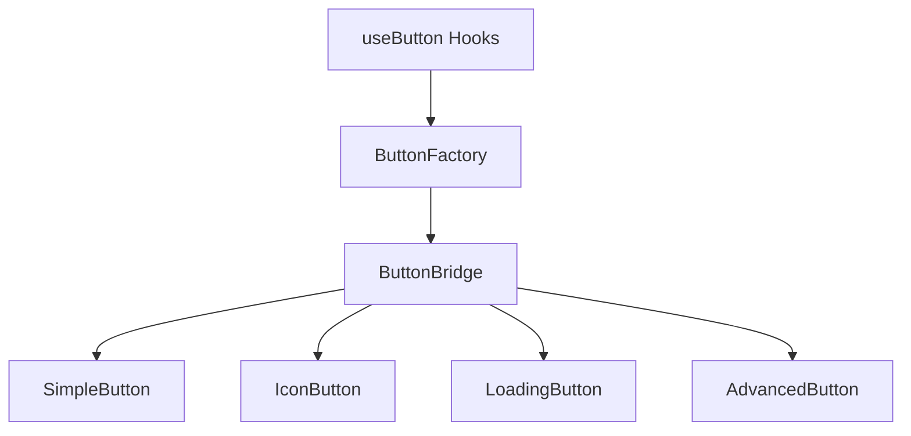
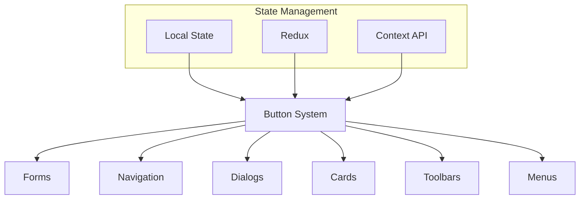

# Advanced Button Component System

A comprehensive, flexible, and future-proof button system for React applications using Material UI and TypeScript.

## Table of Contents

- [Features](#features)
- [Architecture](#architecture)
- [Installation](#installation)
- [Usage](#usage)
  - [Basic Usage](#basic-usage)
  - [Using the Bridge Pattern](#using-the-bridge-pattern)
  - [Using the Factory Pattern](#using-the-factory-pattern)
  - [Using Hooks](#using-hooks)
- [Component Types](#component-types)
- [Props Reference](#props-reference)
- [Advanced Patterns](#advanced-patterns)
- [Form Integration](#form-integration)
- [Accessibility](#accessibility)
- [Styling](#styling)
- [Performance Optimization](#performance-optimization)
- [Testing](#testing)
- [Examples](#examples)
- [Contributing](#contributing)
- [License](#license)

## Features

✨ **Comprehensive**: Multiple button types to cover all common UI needs  
🧩 **Composable**: Easy to combine with other components and UI elements  
🔧 **Flexible**: Adaptable to many different use cases with minimal effort  
📱 **Responsive**: Works well on all screen sizes and devices  
♿ **Accessible**: Follows WCAG guidelines for maximum accessibility  
🔍 **Testable**: Easy to test with data-testid attributes  
🚀 **Performant**: Optimized rendering with React.memo and proper hooks  
🧠 **Developer-friendly**: Reduces boilerplate code with utilities  
📦 **Modular**: Well-structured code following SOLID principles  
🔄 **Future-proof**: Easily extensible for future requirements  

## Architecture

This button system follows a modular architecture based on SOLID principles:

```
src/components/Button/
├── types.ts               # Type definitions and interfaces
├── SimpleButton.tsx       # Simple button component
├── IconButton.tsx         # Icon button component
├── LoadingButton.tsx      # Loading button component
├── AdvancedButton.tsx     # Advanced button with tooltip
├── ButtonBridge.tsx       # Component to unify different button types
├── ButtonFactory.ts       # Factory methods to simplify button creation
├── useButton.ts           # Custom hooks for common button patterns
└── index.ts               # Main export file
```

### Component Hierarchy



### Patterns Used

- **Bridge Pattern**: Decouples abstraction from implementation
- **Factory Pattern**: Simplifies creation of complex objects
- **Hooks Pattern**: Encapsulates stateful logic for reuse
- **Composition Pattern**: Builds complex components from simpler ones

## Installation

```bash
# Install dependencies
npm install @mui/material @mui/lab @emotion/react @emotion/styled
```

## Usage

### Basic Usage

Import and use buttons directly:

```tsx
import { SimpleButton, IconButton, LoadingButton } from '../components/Button';
import { BsHeart } from 'react-icons/bs';

function MyComponent() {
  return (
    <div>
      <SimpleButton 
        label="Click Me" 
        variant="contained" 
        color="primary" 
      />
      
      <IconButton 
        label="Favorite" 
        icon={<BsHeart />} 
        color="secondary" 
      />
      
      <LoadingButton 
        label="Submit" 
        loading={true} 
        variant="contained" 
        color="success" 
      />
    </div>
  );
}
```

### Using the Bridge Pattern

Use the ButtonBridge for dynamic button rendering:

```tsx
import { ButtonBridge } from '../components/Button';

function MyComponent() {
  return (
    <ButtonBridge 
      type="simple" 
      props={{
        label: "Click Me",
        variant: "contained",
        color: "primary"
      }} 
    />
  );
}
```

### Using the Factory Pattern

Use ButtonFactory to reduce boilerplate:

```tsx
import { ButtonBridge } from '../components/Button';
import { ButtonFactory } from '../components/Button/ButtonFactory';
import { BsHeart } from 'react-icons/bs';

function MyComponent() {
  return (
    <ButtonBridge 
      {...ButtonFactory.createSimple("Like", {
        startIcon: <BsHeart />,
        color: "primary"
      })} 
    />
  );
}
```

### Using Hooks

Use custom hooks for stateful buttons:

```tsx
import { ButtonBridge } from '../components/Button';
import { useLoadingButton } from '../components/Button/useButton';
import { BsSave } from 'react-icons/bs';

function MyComponent() {
  const saveButton = useLoadingButton('Save', {
    startIcon: <BsSave />,
    color: 'success'
  });
  
  const handleSave = async () => {
    await saveButton.handleClick(async () => {
      // Your save logic here
      await saveData();
    });
  };
  
  return (
    <div>
      <ButtonBridge {...saveButton.buttonProps} />
      <button onClick={handleSave}>Trigger Save</button>
    </div>
  );
}
```

## Component Types

| Type | Description | Use Case |
|------|-------------|----------|
| **SimpleButton** | Basic button with text and optional icons | Most common UI actions |
| **IconButton** | Icon-only button | Toolbar actions, compact UI |
| **LoadingButton** | Button with loading state | Form submission, async actions |
| **AdvancedButton** | Button with tooltip and additional features | Complex actions requiring explanation |

## Props Reference

### Base Button Props

| Prop | Type | Default | Description |
|------|------|---------|-------------|
| `variant` | 'contained' \| 'outlined' \| 'text' | 'contained' | Button appearance style |
| `color` | 'inherit' \| 'primary' \| 'secondary' \| 'success' \| 'error' \| 'info' \| 'warning' | 'primary' | Button color |
| `label` | string | - | Button text content |
| `disabled` | boolean | false | Disables the button |
| `onClick` | function | - | Click handler |
| `size` | 'small' \| 'medium' \| 'large' | 'medium' | Button size |
| `fullWidth` | boolean | false | Makes button take full width |
| `startIcon` | ReactNode | - | Icon before text |
| `endIcon` | ReactNode | - | Icon after text |
| `href` | string | - | Makes button act as a link |
| `type` | 'button' \| 'submit' \| 'reset' | 'button' | HTML button type attribute |
| `form` | string | - | Form ID for remote form control |
| `sx` | SxProps<Theme> | - | MUI system styling |
| `className` | string | - | Additional CSS class |
| `component` | React.ElementType | - | Component override |

*For the complete list, refer to the types in `types.ts`*

## Advanced Patterns

### Dynamic Button Configuration

```tsx
const buttons = [
  {
    type: 'simple',
    props: {
      label: 'Primary Button',
      variant: 'contained',
      color: 'primary'
    }
  },
  {
    type: 'icon',
    props: {
      label: 'Mail Button',
      icon: <BsMailbox />,
      color: 'secondary'
    }
  }
];

function ButtonCollection() {
  return (
    <div>
      {buttons.map((button, index) => (
        <ButtonBridge 
          key={index} 
          type={button.type} 
          props={button.props} 
        />
      ))}
    </div>
  );
}
```

### Composition with Other Components

```tsx
function CardWithActions() {
  return (
    <Card>
      <CardContent>
        <Typography>Card content</Typography>
      </CardContent>
      <CardActions>
        <ButtonBridge 
          {...ButtonFactory.createSimple("Cancel", {
            variant: "text",
            color: "inherit"
          })} 
        />
        <ButtonBridge 
          {...ButtonFactory.createSubmit("Submit")} 
        />
      </CardActions>
    </Card>
  );
}
```

## Form Integration

Buttons integrate seamlessly with forms:

```tsx
function LoginForm() {
  const { submitButtonProps, resetButtonProps } = useFormButtons(
    'Login',
    'Clear'
  );
  
  const handleSubmit = async (e) => {
    e.preventDefault();
    // Form submission logic
  };
  
  return (
    <form onSubmit={handleSubmit}>
      <input type="email" placeholder="Email" />
      <input type="password" placeholder="Password" />
      <div>
        <ButtonBridge {...resetButtonProps} />
        <ButtonBridge {...submitButtonProps} />
      </div>
    </form>
  );
}
```

## Accessibility

This button system prioritizes accessibility:

- Proper `aria-label` attributes
- Keyboard navigation support with `tabIndex`
- Support for `aria-describedby` for additional descriptions
- Color contrast compliance with MUI theming
- Focus state management

## Styling

Multiple styling options:

1. **MUI System Styling**:
   ```tsx
   <SimpleButton
     label="Styled Button"
     sx={{
       background: 'linear-gradient(45deg, #FE6B8B 30%, #FF8E53 90%)',
       boxShadow: '0 3px 5px 2px rgba(255, 105, 135, .3)',
     }}
   />
   ```

2. **CSS Classes**:
   ```tsx
   <SimpleButton
     label="Styled Button"
     className="my-custom-button"
   />
   ```

3. **Inline Styles**:
   ```tsx
   <SimpleButton
     label="Styled Button"
     style={{ fontWeight: 'bold' }}
   />
   ```

## Performance Optimization

This system includes several performance optimizations:

- **React.memo** for component memoization
- **useCallback** for stable function references
- **forwardRef** for efficient DOM access
- **Conditional rendering** to minimize DOM operations

## Testing

Testing is simplified with data-testid attributes:

```tsx
<SimpleButton
  label="Submit"
  dataTestId="submit-button"
/>
```

Then in tests:

```tsx
// With Testing Library
const submitButton = screen.getByTestId('submit-button');
fireEvent.click(submitButton);
```

## Examples

### Complete Form Example

```tsx
function ContactForm() {
  const { submitButtonProps, resetButtonProps, loading } = useFormButtons(
    'Send Message',
    'Clear Form'
  );
  
  const handleSubmit = async (e) => {
    e.preventDefault();
    await submitButtonProps.onClick();
  };
  
  return (
    <form onSubmit={handleSubmit} className="space-y-4">
      <div>
        <label>Name</label>
        <input type="text" name="name" required />
      </div>
      
      <div>
        <label>Email</label>
        <input type="email" name="email" required />
      </div>
      
      <div>
        <label>Message</label>
        <textarea name="message" required></textarea>
      </div>
      
      <div className="flex gap-2">
        <ButtonBridge {...resetButtonProps} />
        <ButtonBridge {...submitButtonProps} />
      </div>
      
      {loading && <p>Sending message...</p>}
    </form>
  );
}
```

### Responsive Button Adaptation

```tsx
function ResponsiveActionButton() {
  return (
    <>
      {/* Mobile - Icon only */}
      <div className="md:hidden">
        <IconButton
          label="Add Item"
          icon={<BsPlus />}
          color="primary"
          size="large"
        />
      </div>
      
      {/* Desktop - Full button */}
      <div className="hidden md:block">
        <SimpleButton
          label="Add New Item"
          startIcon={<BsPlus />}
          variant="contained"
          color="primary"
        />
      </div>
    </>
  );
}
```

## Future Extensions

The system is designed to be easily extended:

1. **New Button Types**: Just add a new component and update the types
2. **Theme Integration**: Fully compatible with MUI theming system
3. **Animation Support**: Can be extended with animation libraries
4. **State Management**: Works with any state management solution
5. **Custom Variants**: Create your own variant styles beyond MUI defaults

## Customization Chart

| Customization Level | Method | Use Case |
|--------------------|--------|----------|
| **Theme Level** | MUI Theme Provider | Global button styling |
| **Component Level** | Props customization | Per-component styling |
| **Instance Level** | sx prop, className | Specific instance styling |
| **State Level** | Loading, disabled states | Interaction feedback |
| **Content Level** | Icons, labels | Visual communication |

## Future-Proof Design Decisions

- **TypeScript Throughout**: Full type safety for reliable refactoring
- **Modular Architecture**: Easy to update or replace individual components
- **Abstraction Layers**: Bridge and Factory patterns isolate implementation details
- **Consistent API**: Similar prop interfaces across all button types
- **Extensible Hooks**: State management separated from UI components
- **Forward Refs**: Compatible with advanced React patterns
- **Separation of Concerns**: Each file has a single responsibility
- **No Hard Dependencies**: Easy to switch out icon libraries or styling

## Integration Chart



## Comparison with Other Solutions

| Feature | Our System | Basic MUI | Other Libraries |
|---------|------------|-----------|----------------|
| **Typescript Support** | ✅ Full | ⚠️ Partial | ⚠️ Varies |
| **SOLID Principles** | ✅ Yes | ❌ No | ⚠️ Varies |
| **Loading State** | ✅ Built-in | ❌ Manual | ⚠️ Varies |
| **Factory Methods** | ✅ Yes | ❌ No | ❌ Rarely |
| **Hook Integration** | ✅ Custom hooks | ❌ No | ⚠️ Basic |
| **Form Integration** | ✅ Complete | ⚠️ Basic | ⚠️ Varies |
| **Bridging Pattern** | ✅ Yes | ❌ No | ❌ No |
| **Boilerplate Reduction** | ✅ High | ❌ Low | ⚠️ Medium |
