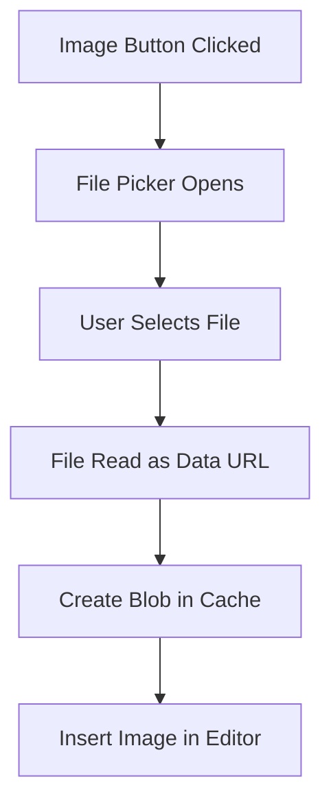

# TinyMCE Integration Documentation


## Table of Contents

- [Overview](#overview)
- [Architecture](#architecture)
- [Installation](#installation)
- [Component Structure](#component-structure)
- [Configuration](#configuration)
  - [Basic Configuration](#basic-configuration)
  - [Theme Support](#theme-support)
  - [Plugins](#plugins)
  - [Toolbar Options](#toolbar-options)
  - [File Uploads](#file-uploads)
- [Integration Diagram](#integration-diagram)
- [API Reference](#api-reference)
- [Performance Considerations](#performance-considerations)
- [Common Issues and Solutions](#common-issues-and-solutions)
- [Future Enhancements](#future-enhancements)
- [Security Considerations](#security-considerations)
- [Contributing](#contributing)
- [License](#license)

## Overview

This project implements a fully-featured, self-hosted TinyMCE rich text editor integration for Next.js 14+ applications. It includes:

- GPL-licensed TinyMCE editor (no API key required)
- RTL language support with Arabic/Persian interface
- Dark/light theme integration with Redux
- File upload capabilities
- Comprehensive toolbar with extensive plugin support
- SSR-compatible implementation using dynamic imports
- Custom font integration

## Architecture

The implementation consists of several key components:

```
components/
├── TinyMceComponent.tsx    # Main editor component
└── config/
    ├── init-options/
    │   ├── filePickerCallBack.ts   # File upload handling
    │   ├── pluginOptions.ts        # Plugin configuration
    │   └── toolBarOption.ts        # Toolbar configuration
    └── ...
public/
└── tinymce/                # Self-hosted TinyMCE files
```

## Installation

1. Install the required dependencies:

```bash
npm install tinymce @tinymce/tinymce-react
```

2. Copy TinyMCE files to your public directory:

```bash
# Create a script that copies TinyMCE files from node_modules to public/tinymce
mkdir -p public/tinymce
cp -r node_modules/tinymce/* public/tinymce/
```

3. Import and use the TinyEditor component in your application.

## Component Structure

| Component | Purpose | Key Features |
|-----------|---------|--------------|
| `TinyEditor` | Main editor wrapper | Theme support, RTL, Redux integration |
| `filePickerCallBack` | File upload handler | Image selection and conversion to blob |
| `pluginOptions` | Plugin configuration | List of all enabled plugins |
| `toolBarOptions` | Toolbar configuration | Layout of toolbar buttons |

## Configuration

### Basic Configuration

The editor component accepts the following props:

```typescript
interface EditorProps {
  initialValue?: string;         // Initial HTML content
  onChange?: (content: string) => void;  // Content change handler
  initOptionsTinyMce?: Omit<InitOptions, 'plugins' | 'toolbar' | 'skin' | 'content_css'>;  // Additional options
}
```

### Theme Support

The editor automatically detects and applies the appropriate theme based on your Redux store's theme configuration:

```typescript
skin: themeConfig.theme === 'dark' ? 'oxide-dark' : 'oxide',
content_css: themeConfig.theme === 'dark' ? 'tinymce-5-dark' : 'tinymce-5',
```

### Plugins

The following plugins are enabled by default:

| Category | Plugins |
|----------|---------|
| Text Formatting | advlist, autolink, lists |
| Media | image, media, table |
| Utilities | link, anchor, charmap, searchreplace, code |
| UI | fullscreen, preview, help, emoticons, visualblocks |
| Advanced | save, autosave, codesample, directionality |
| Special | visualchars, nonbreaking, pagebreak, quickbars, importcss |

### Toolbar Options

The toolbar is configured with the following options:

```
undo redo | formatselect | bold italic backcolor | alignright alignleft aligncenter | 
bullist numlist outdent indent | image media link table | 
fullscreen preview | emoticons | save | print
```

### File Uploads

The component includes a built-in file upload handler that:

1. Opens a file picker dialog when the image button is clicked
2. Reads the selected file as a Data URL
3. Creates a blob in TinyMCE's blob cache
4. Inserts the image into the editor



## Integration Diagram

```
┌─────────────────────────────────────┐
│              Next.js App            │
│                                     │
│  ┌─────────────────────────────┐    │
│  │     TinyMCE Component       │    │
│  │                             │    │
│  │  ┌─────────────────────┐    │    │
│  │  │  Redux Theme Store  │    │    │
│  │  └─────────────────────┘    │    │
│  │                             │    │
│  │  ┌─────────────────────┐    │    │
│  │  │   Editor Config     │    │    │
│  │  │  - Plugins          │    │    │
│  │  │  - Toolbar          │    │    │
│  │  │  - File Uploads     │    │    │
│  │  └─────────────────────┘    │    │
│  │                             │    │
│  └─────────────────────────────┘    │
│                                     │
└─────────────────────────────────────┘
           │
           │ loads
           ▼
┌─────────────────────────────────────┐
│      /public/tinymce/ files         │
│                                     │
│  - GPL-licensed (no API key needed) │
│  - Self-hosted assets               │
│  - Skins (dark/light)               │
│  - Language packs                   │
└─────────────────────────────────────┘
```

## API Reference

### TinyEditor Component

| Prop | Type | Description |
|------|------|-------------|
| `initialValue` | string | Initial HTML content for the editor |
| `onChange` | (content: string) => void | Callback when content changes |
| `initOptionsTinyMce` | Partial<InitOptions> | Additional TinyMCE initialization options |

### Key TinyMCE Config Options

| Option | Type | Description |
|--------|------|-------------|
| `licenseKey` | string | Set to 'gpl' for self-hosted GPL license |
| `height` | number | Editor height in pixels |
| `directionality` | 'ltr' \| 'rtl' | Text direction |
| `plugins` | string[] | Enabled plugins |
| `toolbar` | string | Toolbar configuration |
| `skin` | string | UI skin ('oxide' or 'oxide-dark') |
| `content_css` | string | Content area CSS |
| `file_picker_callback` | function | Custom file picker implementation |

## Performance Considerations

1. **Dynamic Import**: The component uses Next.js dynamic import with `{ ssr: false }` to prevent server-side rendering issues.

2. **Lazy Loading**: TinyMCE is only loaded on the client side, reducing server load.

3. **Redux Integration**: Theme changes trigger re-renders only when necessary.

4. **Mobile Optimization**: Special configuration for mobile devices with reduced features.

## Common Issues and Solutions

| Issue | Solution |
|-------|----------|
| "TinyMCE is running in evaluation mode" | Ensure `licenseKey: "gpl"` is set correctly |
| Resource preloaded but not used | Remove any `<link rel="preload">` tags for TinyMCE |
| Editor not appearing | Check if TinyMCE files exist in the public directory |
| File uploads not working | Verify filePickerCallBack implementation and permissions |
| SSR errors | Ensure the component is wrapped with dynamic import and ssr: false |
| Font not applying | Check content_style configuration and font import |

## Future Enhancements

- [ ] **Cloud Storage Integration**: Add support for uploading files to cloud storage services
- [ ] **Collaborative Editing**: Implement real-time collaborative editing
- [ ] **Custom Plugins**: Develop custom plugins specific to your application needs
- [ ] **Advanced Image Editing**: Integrate image editing capabilities
- [ ] **Form Integration**: Better integration with form libraries like React Hook Form
- [ ] **Accessibility Improvements**: Enhanced keyboard navigation and screen reader support
- [ ] **Localization**: Add support for additional languages
- [ ] **Content Templates**: Predefined content templates for faster editing

## Security Considerations

1. **File Upload Validation**: Always validate uploaded files on the server-side
2. **Content Sanitization**: Use TinyMCE's content filtering to prevent XSS attacks
3. **Self-Hosting Benefits**: Self-hosting TinyMCE reduces external dependencies and potential security risks
4. **Cross-Origin Issues**: Ensure proper CORS configuration when uploading files
5. **User Permissions**: Implement appropriate user permissions for file uploads

## Contributing

Contributions to improve the TinyMCE integration are welcome. Please follow these steps:

1. Fork the repository
2. Create a feature branch (`git checkout -b feature/amazing-feature`)
3. Commit your changes (`git commit -m 'Add some amazing feature'`)
4. Push to the branch (`git push origin feature/amazing-feature`)
5. Open a Pull Request

## License

This TinyMCE integration is available under the MIT license.

TinyMCE itself is used under the GPL license (version 2 or later), which is specified in the editor configuration with `licenseKey: "gpl"`.
